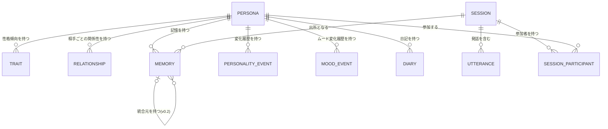
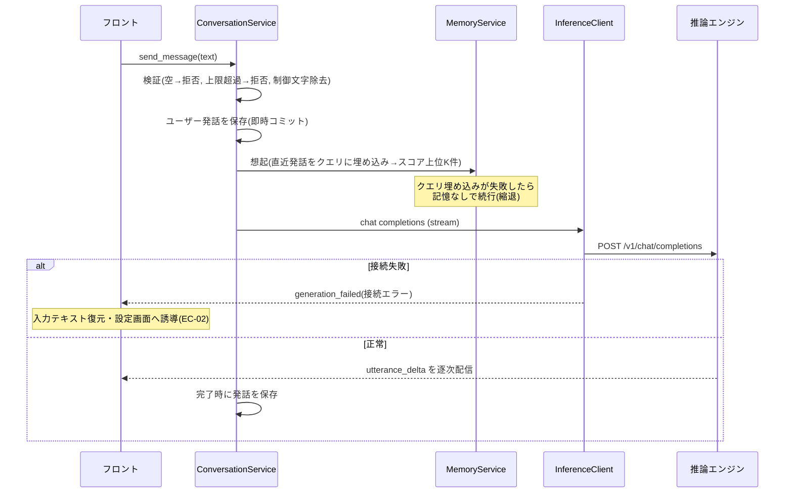

# Personacle 設計書

| 項目 | 内容 |
| --- | --- |
| バージョン | 2.0 (draft) |
| 作成日 | 2026-07-07 |
| 対応する要件書 | docs/requirements.md v2.0 (draft) |
| ステータス | 承認済み (v1.4分 ADR-01〜09 / v0.2追補 ADR-10〜17 とも) |

## 1. 概要

本書は、要件定義書 v2.0 の全要件(FR-01〜35、NFR-01〜09、EC-01〜20)を実現する基本設計・アーキテクチャ設計を記述する。要件書の未解決事項 9-1(UI形態)と 9-2(推論エンジン接続)は本書の ADR-01 / ADR-02 で決定した。v0.2追補(FR-20〜35)の設計判断は ADR-10〜17 に記述し、要件書の未解決事項 9-8〜9-12 への回答(初期値の提案)を含む。

**承認状況**: ADR-01〜09 は承認済み (ADR-01, 02, 04, 05 は設計時に発注者承認。ADR-03, 06, 07 は実装開始と初版のGUI確認をもって承認)。v0.2追補分は全ADR (ADR-10〜17) が発注者承認済み (2026-07-08)。

## 2. 設計方針

1. **ローカル完結**: アプリが行う外部通信は、ユーザーが設定した推論エンジンのエンドポイント(既定 localhost)への HTTP のみとする(NFR-02, 03)
2. **応答経路の最優先**: ユーザーの発話から応答表示までの経路には、応答生成以外の推論(記憶抽出・人格評定・埋め込み計算)を挟まない。これらはセッション確定後の非同期処理に回す(NFR-01)。v0.2の例外は、想起用のクエリ埋め込み(v1.1から存在)と、グループチャットの話者選択推論(出力数トークンの軽量推論。ADR-15)の2つのみとする
3. **追記優先**: 会話・記憶・人格変化はイベントとして追記し、現在値はそこから導出・キャッシュする。破壊的上書きを避け、履歴閲覧(FR-13)と障害時保全(NFR-05)を構造で担保する
4. **推論エンジン非依存**: 推論エンジンへの依存は OpenAI 互換 API の範囲(chat completions / embeddings)に限定する(ADR-02)
5. **ドメインロジックはコアに集約**: UI は表示・入力・ローカル状態のみを持ち、ペルソナ・記憶・人格に関する判断はすべて Rust コアで行う

## 3. 主要設計判断 (ADR)

### ADR-01: UI形態と技術スタック [ステータス: 承認済み]

- **コンテキスト**: 要件の未解決事項 9-1。将来の一般公開(配布容易性)と、SLM がメモリを大量消費する環境でのアプリ本体の軽さが求められる。関連: NFR-07、前提(Windows 11)
- **選択肢**:

  | 案 | 概要 | 利点 | 欠点 |
  | --- | --- | --- | --- |
  | A: Tauri 2 | Rust コア + WebView(TypeScript)のデスクトップアプリ | 配布サイズ・メモリ消費が小さい。チャットUIをWeb技術で構築できる。単一インストーラ配布 | Rust の学習コスト |
  | B: Electron | 全て TypeScript | 開発が速い | 配布サイズ100MB超、メモリ消費大。SLMと同居するアプリとして不利 |
  | C: C#/.NET | WinUI 3 / Avalonia | Windows親和性、単一exe配布 | チャットUI部品を自作する量が多い |
  | D: Python+ブラウザ | ローカルWebサーバー | プロトタイピング最速 | 一般公開時の配布が最も弱い |

- **決定**: 案A(Tauri 2 + TypeScript フロントエンド)。決め手はメモリフットプリントと配布容易性
- **却下理由**: B はSLM同居環境でのメモリ消費が方針に反する。C はチャットUIの構築コストが高い。D は「将来公開」の配布要件に対して最弱
- **影響**: 全体構成は Tauri のプロセスモデル(ADR-03)に従う。コア言語は Rust

### ADR-02: 推論エンジンとの接続方式 [ステータス: 承認済み]

- **コンテキスト**: 要件の未解決事項 9-2。FR-16(接続設定)、NFR-01(性能)、NFR-02(オフライン)。特定エンジンへのロックインを避けたい
- **選択肢**:

  | 案 | 概要 | 利点 | 欠点 |
  | --- | --- | --- | --- |
  | A: OpenAI互換API標準 | chat completions + embeddings を接続仕様とし、推奨・検証対象エンジンは Ollama | Ollama / llama.cpp server / LM Studio が同一仕様で動く。将来のクラウド対応(要件書の将来拡張)も同一IF | エンジン固有機能(モデル自動ロード)を使えない |
  | B: Ollamaネイティブ専用 | Ollama 独自APIに密結合 | モデル一覧取得・自動ロードでUX向上 | ロックイン。他エンジン利用者を切り捨てる |
  | C: 推論ライブラリ内蔵 | llama.cpp をアプリに組み込む | セットアップ最楽 | 要件の non-goals(エンジン同梱は初版対象外)に反する |

- **決定**: 案A。決め手は依存の軽さと変更容易性
- **却下理由**: B はロックインの不利益が UX 向上を上回る(モデル一覧取得のみ、OpenAI互換の `GET /v1/models` で代替可能)。C は要件変更が必要であり初版では見送り
- **影響**: InferenceClient(6章)の仕様は OpenAI 互換 API に固定。導入手順書(NFR-07)は Ollama を前提に書く

### ADR-03: 全体構成 [ステータス: 承認済み]

- **コンテキスト**: ADR-01 の帰結として構成を確定する。関連: 全FR
- **選択肢**:

  | 案 | 概要 | 利点 | 欠点 |
  | --- | --- | --- | --- |
  | A: Tauri単一プロセス | Rust コアにドメインロジック、WebView フロントは表示に徹する。通信は Tauri command / event | プロセス管理不要。IPC が型付きで単純 | コアとUIの言語が分かれる |
  | B: フロント + ローカルHTTPサーバー分離 | Rust を HTTP サーバーとして起動しフロントは fetch | Web版への転用が容易 | ポート管理・多重起動・サーバー生存監視が必要。シングルユーザー要件に過剰 |

- **決定(推奨)**: 案A。決め手は複雑さの低さ。シングルユーザー・ローカル完結(要件3章の前提)では分離の利点がない
- **却下理由**: B の利点(Web転用)は non-goals(クラウド化は別プロジェクト)に対応する投資であり、初版では過剰
- **影響**: コンポーネント間IFは Tauri command / event として設計する(6章)

### ADR-04: 記憶の想起方式 [ステータス: 承認済み]

- **コンテキスト**: FR-09(関連記憶の想起)、NFR-01(応答性能)、NFR-04(記憶1万件)、EC-06(上限到達)。日本語は表記ゆれが多く、キーワード一致だけでは「好物」と「好きな食べ物」を結べない
- **選択肢**:

  | 案 | 概要 | 利点 | 欠点 |
  | --- | --- | --- | --- |
  | A: ハイブリッド | 埋め込み類似度 + 新しさ + 重要度の加重スコアで上位K件を想起 | 意味的な関連を拾い、直近の約束や重要な出来事が古い雑談に埋もれない | 埋め込み計算が必要(バックグラウンドで実施) |
  | B: 全文検索のみ | SQLite FTS のキーワード検索 | 依存最小・高速 | 日本語の表記ゆれ・同義語に弱く FR-09 の品質が不安 |
  | C: 埋め込みのみ | ベクトル類似度単独 | 実装が単純 | 新しさ・重要度を無視し、直近の約束より古い類似記憶が出うる |

- **決定**: 案A。スコア式は `score = w_sim × 類似度 + w_rec × 新しさ減衰 + w_imp × 重要度`(重みは設定値、初期値は 8 章)。埋め込みは推論エンジンの embeddings API を使い追加依存なし
- **却下理由**: B は日本語品質、C は想起の時間感覚の欠如
- **影響**: 記憶エンティティは埋め込みベクトルと重要度を持つ(5章)。埋め込み計算はセッション後処理(ADR-06)に含める

### ADR-05: 人格プロファイルの表現 [ステータス: 承認済み]

- **コンテキスト**: FR-12(変化量上限のある成長)、FR-13(現在値と履歴の閲覧)、要件の未解決事項 9-4
- **選択肢**:

  | 案 | 概要 | 利点 | 欠点 |
  | --- | --- | --- | --- |
  | A: 数値軸+自由記述 | 性格傾向と関係性は数値軸で持ち変化量上限を数値で強制。相手ごとに短い自由記述(印象メモ)を併せ持つ | FR-12 の受け入れ基準(上限検証)をそのまま満たし、質的なニュアンスも表現できる | 2系統の更新処理が必要 |
  | B: 数値のみ | 性格軸と関係値だけ | 検証容易 | 「あの件以来気まずい」のような質的変化を表現できない |
  | C: 自由記述のみ | テキストをLLMが書き換え | 表現力最大 | 変化量上限を定義できず FR-12 を満たせない |

- **決定**: 案A。性格軸・関係性の数値定義と変化量上限の初期値は 5 章に示す(最終値は要件 9-4 のとおりプロトタイプで検証)
- **却下理由**: C は FR-12 の受け入れ基準を構造的に満たせない。B は成長の体験価値を損なう
- **影響**: 人格更新はLLMによる評定(デルタ提案)+コアによるクランプの2段構成(7章フロー3)

### ADR-06: 記憶生成・人格更新のタイミング [ステータス: 承認済み]

- **コンテキスト**: FR-08(記憶生成)、FR-12(人格更新)、NFR-01(応答性能)、EC-03(強制終了)。SLM は低速であり、対話中に抽出用の推論を挟むと応答性能を害する
- **選択肢**:

  | 案 | 概要 | 利点 | 欠点 |
  | --- | --- | --- | --- |
  | A: セッション確定後の非同期バッチ | セッション終了を契機にバックグラウンドで記憶抽出→埋め込み→人格評定を実行。未処理セッションは起動時に再処理 | 応答経路に追加推論ゼロ(NFR-01)。強制終了しても再処理で回復(EC-03) | セッション終了までは新規記憶が想起に載らない |
  | B: 発話ごと逐次抽出 | 各応答の後に毎回抽出 | 記憶の反映が最速 | 毎発話で推論が倍増し NFR-01 を圧迫。SLMの速度では非現実的 |

- **決定(推奨)**: 案A。同一セッション内の情報参照は会話履歴(プロンプト内)で担保されるため、記憶化がセッション終了後でも FR-05/09 の受け入れ基準を満たせる
- **却下理由**: B は NFR-01 と両立しない
- **影響**: セッションに処理状態(5章 `status`)を持たせ、起動時リカバリを実装する(7章フロー4)

### ADR-07: データ永続化方式 [ステータス: 承認済み]

- **コンテキスト**: FR-17(永続化)、NFR-04(容量)、NFR-05(強制終了時のデータ保全)
- **選択肢**:

  | 案 | 概要 | 利点 | 欠点 |
  | --- | --- | --- | --- |
  | A: SQLite 単一DB(WALモード) | 全データを1つのDBファイルに保存 | トランザクションで NFR-05(破損防止)を担保。1万件規模の検索・一覧(NFR-04)に十分。バックアップ=1ファイル | 記憶や人格を外部エディタで直接編集できない |
  | B: JSON/Markdownファイル群 | ペルソナごとのフォルダにテキスト保存 | 人が読める。Git管理できる | 書き込み中の強制終了で破損しうる(NFR-05)。件数増で一覧・検索が劣化(NFR-04) |

- **決定(推奨)**: 案A。決め手は NFR-05。埋め込みベクトルは BLOB カラムに格納し、1万件規模なら全走査の類似度計算で十分(8章の性能見積もり参照)。専用ベクトルDBは導入しない
- **却下理由**: B は強制終了時の保全を自前実装する必要があり複雑化する。人が読める形式の利点はアプリ内の閲覧画面(FR-10/13)とエクスポート(FR-18)で代替する
- **影響**: データ設計(5章)は SQLite の論理スキーマとして記述

### ADR-08: 3体以上の自律会話の発話順と後処理 [ステータス: 承認済み]

- **コンテキスト**: FR-19 (Could)。要件は発話順の制御方式を設計に委ねている。FR-12(1セッションあたりの変化量上限)との整合も必要
- **選択肢**:

  | 案 | 概要 | 利点 | 欠点 |
  | --- | --- | --- | --- |
  | A: ラウンドロビン | 参加者の登録順で巡回して発話 | 受け入れ基準「全員が1回以上発話」を決定的に満たす。実装・検証が単純 | 会話の流れ次第では不自然な順になりうる |
  | B: LLMによる次話者選択 | 毎ターン「次に話すべき者」をLLMに選ばせる | 会話として自然 | 推論が毎ターン1回増え低速。特定ペルソナが発話しない可能性があり受け入れ基準を保証できない |

- **決定(推奨)**: 案A。参加数上限は6体(コンテキスト予算と後処理コストの上限)。後処理の関係性評定は「自分以外の各参加者」ごとに実行し、**性格軸デルタの適用はセッションあたり1回のみ**とする(相手ごとに重ねて適用すると FR-12 の1セッション上限を実質超えるため)
- **却下理由**: B は受け入れ基準の保証と NFR-01 の観点で初版に不適。将来の差し替えポイントとしてターンループの発話者選択は分離してある
- **影響**: 7章フロー2 は参加者N体の巡回として一般化。プロンプトの「会話相手」節は複数相手の列挙に対応

### ADR-09: ペルソナのエクスポート形式 [ステータス: 承認済み]

- **コンテキスト**: FR-18 (Could)。「育てたキャラの共有」のため、ペルソナ1体分を別環境へ移せるファイル形式が必要。要件は会話履歴の同梱を選択制と定める
- **選択肢**:

  | 案 | 概要 | 利点 | 欠点 |
  | --- | --- | --- | --- |
  | A: JSON 1ファイル(埋め込み除外) | persona/trait/relationship/memory/personality_event (+選択で sessions) を JSON に書き出し、埋め込みは取込後に再計算 | 人が読める。埋め込みモデルが異なる環境でも成立。ファイルが小さい | 取込直後は想起が縮退(再計算完了まで) |
  | B: 埋め込み込みで完全複製 | ベクトルも書き出す | 取込直後から想起可能 | 移行先の埋め込みモデルが違うと無意味どころか有害。ファイル巨大 |
  | C: DBファイルごとコピー | personacle.db を渡す | 実装ゼロ | 1体単位にできず全ペルソナ・全会話が露出する。共有用途に不適 |

- **決定(推奨)**: 案A。ファイルに `format` / `formatVersion` / `appSchemaVersion`(設計5.3) を記録し、
  未対応バージョンは取込を拒否する。ID は取込時に全て新規発行し、出所セッション等の参照は張り替える。
  履歴を含めた場合のセッションは status=processed で取り込み、後処理の再実行(記憶の二重生成)を防ぐ。
  同名ペルソナが既存の場合は EC-04 と同様に警告+force。存在しない相手ペルソナへの関係参照は
  名前スナップショットで表示する(EC-07 と同じ扱い)
- **却下理由**: B は推論エンジン非依存の方針(設計方針4)と両立しない。C は共有の単位が要件と合わない
- **影響**: ファイル選択に公式 dialog プラグインを追加。取込後に埋め込み再計算ジョブを投入する

### ADR-10: 話しかけのセッション扱い [ステータス: 承認済み]

- **コンテキスト**: FR-21(話しかけ)、NFR-09(初文字10秒)、EC-13(接続不可)、EC-14(重複防止)、要件9-8。話しかけを既存のセッション・発話モデルにどう載せるかで、履歴・後処理・重複防止の実現が変わる
- **選択肢**:

  | 案 | 概要 | 利点 | 欠点 |
  | --- | --- | --- | --- |
  | A: セッション内の通常発話 | 画面オープンでセッションを開始し、話しかけをそのセッションの最初の発話として保存 | 既存のセッション状態機械・ストリーミング・履歴閲覧をそのまま使える。EC-14は「activeセッションの存在」で判定できる | ユーザーが無応答のまま閉じると発話1件のセッションが残る |
  | B: セッション外の仮発話 | 話しかけは保存せず表示のみ。ユーザーが応答した時点でセッションを作成し話しかけを遡って保存 | 無応答なら痕跡が残らない | 仮状態という新しい状態管理が増える。表示済みの話しかけがアプリ強制終了で消える(履歴と画面の不一致) |

- **決定(推奨)**: 案A。無応答セッションの問題は「**ユーザー発話が0件のセッションは後処理(記憶抽出・人格評定・ムード評定・日記)をスキップして processed に直行する**」ルールで解消する(会話が成立していないため FR-08 の抽出対象となる情報がない)
- **却下理由**: B は状態管理の複雑さが利点(痕跡が残らない)に見合わない。話しかけが履歴に残ることは FR-06(全発話の保存)とも整合する
- **影響**: EC-14 は「対象ペルソナとの user_dialogue セッションが active の間は再生成しない」+「セッション終了後も、前回の話しかけから60分(設定値、初期値の根拠は要件9-8としてプロトタイプで検証)は再生成しない」で実現。EC-13 は話しかけ生成の失敗を無通知の縮退とする(フロー6)

### ADR-11: 時間経過の認識方式 [ステータス: 承認済み]

- **コンテキスト**: FR-20(応答への時間経過の反映)、EC-18(時計巻き戻し)、要件9-8。SLM に日時の差分計算をさせると誤答が多い
- **選択肢**:

  | 案 | 概要 | 利点 | 欠点 |
  | --- | --- | --- | --- |
  | A: コアで区分ラベル化 | コアが前回セッション終了からの経過時間を計算し、区分ラベル(「約3日ぶりの会話」)としてプロンプトに注入 | SLM に算術をさせない。閾値未満・経過が負のときはラベルを注入しないだけで FR-20 の受け入れ基準2 と EC-18 を構造的に満たす | 区分の粒度がコード側の定義に固定される |
  | B: 生の日時を渡す | 前回と現在の日時をそのままプロンプトに書き、LLM に解釈させる | 実装最小 | SLM の日時計算は不安定で、FR-20 の受け入れ基準(7/10)を満たせないリスクが大きい |

- **決定(推奨)**: 案A。経過区分の初期値: 6時間未満=注入なし / 6〜48時間=「少し間が空いた」 / 48時間〜14日=「約N日ぶり」 / 14日超=「長い間会っていなかった」(閾値は設定値)
- **却下理由**: B は品質リスクが大きく、失敗しても改善手段がプロンプト調整しかない
- **影響**: PromptBuilder の system プロンプト構成(6.4)に「経過時間ラベル」を追加。話しかけ(ADR-10)と通常応答の両方で同じラベルを使う

### ADR-12: 記憶統合のトリガーと類似判定 [ステータス: 承認済み]

- **コンテキスト**: FR-22(自動統合)、FR-23(由来)、EC-15(処理中の強制終了)、EC-20(対象不足)、要件9-9。統合をいつ・何を対象に実行するか
- **選択肢**:

  | 案 | 概要 | 利点 | 欠点 |
  | --- | --- | --- | --- |
  | A: セッション後処理に組み込み | 後処理の末尾で、当該セッションから生まれた新規記憶それぞれについて既存記憶との類似クラスタを検出し、条件を満たしたクラスタのみ統合 | 統合の契機=記憶の追加という自然な流れ。既存の直列キュー・起動時リカバリ(EC-03/15)をそのまま使える。1回の処理が小さい | 記憶の追加がない限り既存の重複は整理されない(初回は移行時に一括実行で補う) |
  | B: 件数閾値の一括整理 | 記憶がN件を超えたら全体を対象にバッチ実行 | まとめて整理できる | 1回の処理が重く(クラスタリング+多数の統合推論)、実行中の強制終了の影響範囲が広い。閾値到達までの重複が放置される |
  | C: 起動時アイドルバッチ | 起動時に未整理分を検出して実行 | 対話中の負荷ゼロ | 起動直後は推論エンジンのモデルロード(CPU環境で数十秒)と重なり、最初の対話体験を悪化させる |

- **決定**: 案A(2026-07-08 発注者承認)。類似判定はペルソナの既存埋め込みを使い、**新規記憶とのコサイン類似度 0.80 以上(設定値)の非アーカイブ既存記憶が、新規記憶を含めて5件以上**でクラスタ成立とする(FR-22 受け入れ基準の「5件以上」と整合)。統合文・種別・重要度は LLM が生成し、コアが検証する。スキーマ移行(v1→v2)の直後に一度だけ全記憶を対象とする初回整理を後処理キューへ投入する
- **却下理由**: B は EC-15 の影響範囲と処理の重さ。C は起動直後の体験悪化(モデルロードとの競合)
- **影響**: 統合記憶の挿入・由来リンクの記録・元記憶のアーカイブは1トランザクションで行う(EC-15: 二重生成防止は由来リンクの存在検査+直列キューで担保)。EC-20: クラスタ不成立なら何もしない(ログにも記録しない)。EC-16: 統合記憶の削除時、フロントが「元記憶を想起対象に戻すか」を確認し、戻す場合はアーカイブ解除+由来リンク削除を行う

### ADR-13: ムードの表現形式と回帰 [ステータス: 承認済み]

- **コンテキスト**: FR-24(保持と応答反映)、FR-25(閲覧)、要件9-10。人格プロファイル(長期)と独立した短期状態の表現。アプリは常駐しないため、時間経過による回帰を常駐処理なしで実現する必要がある
- **選択肢**:

  | 案 | 概要 | 利点 | 欠点 |
  | --- | --- | --- | --- |
  | A: 1軸+状態ラベル | 快-不快の1軸(-100〜+100、平常0)と、LLM が生成する短い状態ラベル(10文字以内。例「上機嫌」)の併用 | SLM の評定が安定しやすい(1値+1語)。ADR-05(数値軸+自由記述)と同じハイブリッド構成で一貫する。表示が単純 | 「静かな満足」と「はしゃぎ」を数値では区別できない(ラベルで補う) |
  | B: 2軸(快-不快×活性) | ラッセル円環モデル | 感情表現の解像度が高い | SLM に2軸を安定評定させる難易度が上がる。UIも複雑化 |
  | C: プリセット感情タグ | 「喜」「怒」「哀」「楽」「平常」の選択式 | 評定は最も安定 | 強度がなく、回帰の途中状態を表現できない(FR-24 の漸次回帰が段階的になる) |

- **決定**: 案A(2026-07-08 発注者承認)。回帰は**遅延計算**で実現する: 保存するのは評定時の値と日時のみとし、現在値は読み出し時に `現在値 = 保存値 × 0.5^(経過時間/半減期)` で導出する(半減期は設定値、初期値24時間)。|現在値| が10未満のときラベルは「平常」に置き換える。ムードの評定は既存のセッション後処理の人格評定(フロー3手順3)と**同一の推論の出力項目に追加**し、追加の推論を発生させない。1セッションあたりのムード変化量はコアで±50にクランプする
- **却下理由**: B は評定安定性、C は漸次回帰の表現力。いずれも FR-24 の受け入れ基準(トーン判別 7/10、回帰)の達成リスクが A より高い
- **影響**: PromptBuilder(6.4)にムードの言語化を追加。データ設計にムード現在値(ペルソナ)とムード変化イベント(FR-25 の変動要因)を追加。FR-24 の「人格の値を直接変更しない」は、ムードが trait / relationship と別の保存領域を持つことで構造的に担保

### ADR-14: 日記の生成タイミング [ステータス: 承認済み]

- **コンテキスト**: FR-26(生成)、FR-27(閲覧)、EC-17(日またぎ)。アプリは常駐せず、「日の終わり」に確実に稼働している保証がない
- **選択肢**:

  | 案 | 概要 | 利点 | 欠点 |
  | --- | --- | --- | --- |
  | A: 当日分を都度更新 | セッション後処理の末尾で、そのセッションの開始日の日記を生成・上書き | 対話したその日のうちに日記が読め、育成実感に直結する。生成失敗しても次のセッションで再生成される | 1日に複数セッションを行うと日記生成が複数回走る(デバウンスで抑制) |
  | B: 翌日以降に確定生成 | 日付が変わった後の最初の起動時に前日以前の未生成分を生成 | 生成は1日1回で最小 | 当日の日記が翌日まで読めない |
  | C: 当日暫定+翌日確定 | Aの表示とBの確定を両立 | 体験は最良 | 暫定/確定の2状態管理が増え、コストに見合う差が出ない |

- **決定**: 案A(2026-07-08 発注者承認)。同一(ペルソナ, 日付)の日記生成ジョブがキューに複数並んだ場合は1つに束ねる(デバウンス)。起動時リカバリで「対話があった日のうち、日記が存在しないか、最後のセッション終了より日記が古い日」を検出して再生成し、B の網羅性も担保する
- **却下理由**: B は当日に読めない点が「育成実感」という v0.2 の目的に反する。C は状態管理の増加が利点に見合わない
- **影響**: 日記はセッション開始日に帰属させる(EC-17: 日をまたいだセッションも開始日の日記1件のみに反映)。日記エンティティは(ペルソナ, 日付)で一意とする

### ADR-15: グループチャットの話者選択と連鎖発話 [ステータス: 承認済み]

- **コンテキスト**: FR-31(文脈に基づく1体の応答)、FR-32(指名)、FR-33(連鎖発話)、FR-34(反映)、NFR-01、要件9-12。ADR-08 は自律会話で LLM 選択を却下したが、グループチャットは要件自体が文脈に基づく選択を求めており前提が異なる
- **選択肢**:

  | 案 | 概要 | 利点 | 欠点 |
  | --- | --- | --- | --- |
  | A: LLM選択+コア補正 | 直近の会話と参加者一覧を渡し「次に応答する人物名のみ」を出力させる軽量推論。コアが補正規則を適用 | 会話の流れ(誰宛の発言か、誰の話題か)を読める。補正で FR-31 の全員応答基準を確率的に担保 | 応答のたびに推論が1回増える(出力数トークン・低温度で1〜3秒の見込み) |
  | B: 埋め込み類似で選択 | ユーザー発話と各ペルソナのプロファイル・記憶の類似度で選択 | 追加推論なしで最速 | 話題の関連しか見ず、「さっき○○さんが言った件」のような会話の流れを読めない |
  | C: ラウンドロビン | ADR-08 と同じ巡回 | 実装最小 | FR-31 の「発話の内容と文脈に基づいて選ばれた1体」を満たさない(要件違反) |

- **決定**: 案A(2026-07-08 発注者承認)。コアの補正規則: (1) 指名(FR-32)があれば推論をスキップして指名者を選ぶ (2) 同一ペルソナの3連続応答を禁止し、該当時は次点へ (3) セッション内で未応答のペルソナがいる間は、選択プロンプトの候補提示で未応答者を優先明示する (4) LLM の出力が参加者名のいずれにも一致しない場合はラウンドロビンにフォールバックする。連鎖発話(FR-33)は、ペルソナの応答完了後に連鎖数が上限(既定2、設定値)未満であれば、選択肢に「発話なし」を加えた同じ選択推論で次話者を判定し、「発話なし」なら待機に戻る。連鎖判定より前にユーザー発話が到着した場合はユーザー発話を優先する
- **却下理由**: B は会話の流れを読めず FR-31 の判別品質が不安。C は要件違反。ADR-08(自律会話)をAに合わせて変更することは、自律会話では発話順の保証(受け入れ基準)が優先されるため行わない
- **影響**: 設計方針2の例外として話者選択推論を明記(2章)。参加上限はユーザー+6体(自律会話の上限と同値。要件9-12 の仮置きに対する初期値。連鎖込みのテンポはリスク R-6 で実測)。FR-34 の後処理は自律会話の参加者ごと処理(フロー2手順4)と同一機構を使い、ユーザーへの関係性も更新対象に含める

### ADR-16: 停滞検出と話題転換 [ステータス: 承認済み]

- **コンテキスト**: FR-35(停滞の検出と話題転換)、EC-12(v0.2で対処に変更)、要件9-11。検出を毎ターン安価に行う必要がある
- **選択肢**:

  | 案 | 概要 | 利点 | 欠点 |
  | --- | --- | --- | --- |
  | A: 埋め込み類似度で検出 | 各発話の生成後に埋め込みを計算し、同一話者の直近発話とのコサイン類似度が閾値以上のターンが連続したら停滞と判定 | 追加の生成推論なし(embeddings は数百ミリ秒)。判定が決定的で受け入れ基準3(誤挿入なし)を検証しやすい | 「表現は違うが同じ趣旨」の検出は埋め込みの品質に依存 |
  | B: LLMで毎ターン判定 | 毎ターン「会話が停滞しているか」を推論 | 趣旨の同一性を最も良く判定できる | 自律会話の毎ターンに生成推論が1回増え、進行が目に見えて遅くなる。判定が非決定的 |
  | C: 表層一致(n-gram重複率) | 文字列の重複率で判定 | 依存ゼロ・最速 | 日本語の表記ゆれ・言い換えに弱い(ADR-04 で全文検索を却下したのと同じ理由) |

- **決定(推奨)**: 案A。初期値: 同一話者の直近発話との類似度 0.85 以上(設定値)が2ターン連続で停滞と判定。話題転換は、コアが LLM に「これまでのテーマから派生する新しい話題」を1文生成させ、**司会役のシステム発話**としてセッションに挿入する(発話者種別: system)。以後のプロンプトにはこのシステム発話が履歴として含まれ、話題が転換される。転換は1セッション最大2回とし、3回目の停滞はターン上限(FR-14)に委ねる
- **却下理由**: B は自律会話の進行速度への影響と非決定性。C は日本語品質
- **影響**: 発話者種別に system を追加(データ設計5.2)。FR-35 の「発生位置の確認」はシステム発話が履歴に残ることで実現。自律会話の発話埋め込みはターンループ内で計算するため、後処理の埋め込み計算(フロー3手順2)では計算済みのものを再利用する

### ADR-17: 時系列グラフ・関係図の描画手段 [ステータス: 承認済み]

- **コンテキスト**: FR-29(成長ダッシュボード)、FR-30(関係図)、NFR-08(3秒以内)。NFR-03(ローカル完結)により CDN 読み込みは不可、導入するならバンドルが必要
- **選択肢**:

  | 案 | 概要 | 利点 | 欠点 |
  | --- | --- | --- | --- |
  | A: 自作SVG | 折れ線グラフと円環配置の関係図を SVG で自前描画 | 依存追加ゼロ。既存フロントがフレームワークなしの TypeScript であり構成が一貫する。必要な図種は2つだけ | 描画機能(軸、目盛、ツールチップ)を自前実装する |
  | B: チャートライブラリ導入 | 汎用チャートライブラリをバンドル | 機能が豊富で実装が速い | 折れ線1種のためにバンドルサイズと供給リスク(保守状況)を負う。関係図は別ライブラリが必要になりがち |

- **決定(推奨)**: 案A。必要なのは「性格5軸の折れ線」「親密度の折れ線」「円環配置+辺の太さで親密度を示す関係図」の3描画のみで、汎用ライブラリの導入コストに見合わない。データ点数は変化履歴がセッション単位(NFR-04 の規模で最大数千点)であり、間引き(表示幅に応じた集約)で NFR-08 を満たす
- **却下理由**: B は依存の重さ。将来グラフ種が増えて自作の限界が来た時点で再検討する(その際もこの ADR を改版する)
- **影響**: フロントエンドにグラフ描画モジュールを追加。コアは系列データ(日時と値の配列)を返すだけとし、描画判断を持たない(設計方針5)

## 4. システム構成

```mermaid
graph TB
    subgraph "Tauri アプリ (単一プロセス)"
        subgraph "WebView フロントエンド (TypeScript)"
            UI[画面群<br/>チャット(1対1/グループ) / ペルソナ管理 /<br/>記憶・人格ビューア / ダッシュボード /<br/>日記 / 関係図 / 設定]
        end
        subgraph "Rust コア"
            CMD[Command Facade]
            PS[PersonaService]
            CS[ConversationService]
            MS[MemoryService]
            PLS[PersonalityService]
            PB[PromptBuilder]
            BW[BackgroundWorker]
            IC[InferenceClient]
            ST[Storage]
        end
    end
    OLLAMA[推論エンジン<br/>OpenAI互換API<br/>既定: Ollama @ localhost]
    DB[(SQLite<br/>WALモード)]

    UI -- "command 呼び出し" --> CMD
    CMD -- "event (ストリーミング)" --> UI
    CMD --> PS & CS & MS & PLS
    CS --> PB
    PB --> MS
    CS --> IC
    BW --> IC
    BW --> MS & PLS
    PS & CS & MS & PLS & BW --> ST
    ST --> DB
    IC -- "HTTP" --> OLLAMA
```

| コンポーネント | 責務 |
| --- | --- |
| 画面群 (TS) | 表示・入力・画面内状態のみを持つ。ドメイン判断はしない |
| Command Facade | Tauri command / event の境界。入力検証(空入力、文字数上限、制御文字除去)をコアの入口として一元的に行う |
| PersonaService | ペルソナの作成・一覧・編集・削除。同名警告(EC-04)と削除時の関連データ整理(EC-07) |
| ConversationService | セッションのライフサイクル管理(開始・発話・終了)、1対1対話・自律会話・グループチャット(v0.2)のターン進行、話しかけの生成と重複防止(v0.2, ADR-10)、話者選択と連鎖発話(v0.2, ADR-15)、停滞検出と話題転換(v0.2, ADR-16)、生成キャンセル、ペルソナの排他制御(EC-08/19) |
| PromptBuilder | 人格プロファイル・想起記憶・会話履歴から、トークン予算内でプロンプトを組み立てる。v0.2: 経過時間ラベル(ADR-11)・ムードの言語化(ADR-13)・グループ参加者の列挙を追加 |
| MemoryService | 記憶の保存・想起(ハイブリッドスコアリング)・閲覧・編集・削除・上限時のアーカイブ(EC-06)。v0.2: キーワード検索と絞り込み(FR-28)、類似クラスタ検出と統合の適用(ADR-12) |
| PersonalityService | 人格プロファイルの現在値管理、評定デルタのクランプと適用、変化イベントの追記。v0.2: ムードの現在値導出(半減期の遅延計算)と変化イベントの追記(ADR-13) |
| BackgroundWorker | セッション確定後の後処理(記憶抽出→埋め込み→人格・ムード評定→記憶統合→日記)を直列キューで実行。起動時に未処理セッション・未生成日記を回収 |
| InferenceClient | OpenAI互換APIクライアント。chat completions(ストリーミング)/ embeddings / models。接続エラーの分類(8章) |
| Storage | SQLite への読み書き。トランザクション境界の管理 |

## 5. データ設計

### 5.1 エンティティと関係



### 5.2 エンティティ定義(論理)

**persona** — AIキャラクター本体

| 属性 | 内容 |
| --- | --- |
| id | 一意ID |
| name | 名前(同名可・EC-04は警告のみ) |
| description / speech_style / values_text / self_intro | 初期設定4項目(FR-01)。編集可(FR-03) |
| created_at / last_talked_at | 作成日時・最終対話日時(FR-02)。last_talked_at は経過時間ラベル(ADR-11)の基準にも使う |
| mood_value / mood_label / mood_rated_at | ムードの評定時の値(-100〜+100)・状態ラベル・評定日時(v0.2, ADR-13)。現在値は読み出し時に半減期で減衰計算 |
| last_greeting_at | 最後に話しかけを生成した日時(v0.2, EC-14 の再生成間隔判定) |

削除は**物理削除**(FR-04「復元できない」)。ただし他ペルソナ側に残るデータは 5.4 参照。

**trait** — 性格傾向(ペルソナ×軸)

| 属性 | 内容 |
| --- | --- |
| persona_id / trait_key | ペルソナと軸の複合キー |
| value | 0〜100 |

性格軸(2026-07-08 正式値として発注者承認・要件9-4解決): `社交性` `共感性` `慎重さ` `自己主張` `明朗さ` の5軸。作成時は初期設定文からLLMが初期値を評定し、ユーザーが調整できる。**1セッションあたり変化量上限: 各軸±2**(設定値)。

**relationship** — 相手ごとの関係性

| 属性 | 内容 |
| --- | --- |
| persona_id | 主体ペルソナ |
| target_kind / target_id | 相手(user または persona) |
| target_name | 相手名のスナップショット(相手ペルソナ削除後も表示可能にする・EC-07) |
| intimacy | 親密度 0〜100(初期値20)。**1セッションあたり変化量上限±5**(設定値) |
| impression_text | 短い自由記述の印象メモ(200文字以内)。セッション後処理でLLMが更新 |

**session** — 会話セッション

| 属性 | 内容 |
| --- | --- |
| id / kind | kind: user_dialogue / autonomous / group(v0.2, FR-31) |
| theme | 自律会話のテーマ(FR-14)。1対1・グループでは空 |
| status | `active` → `ended` → `processed` の一方向遷移。後処理の進行管理と起動時リカバリ(EC-03)に使う。ユーザー発話0件のセッションは ended から processed へ後処理なしで直行(v0.2, ADR-10) |
| started_at / ended_at | 日時。started_at の日付が日記の帰属先(EC-17) |

**utterance** — 発話(追記のみ)

| 属性 | 内容 |
| --- | --- |
| id / session_id | 所属セッション |
| speaker_kind / speaker_id / speaker_name | 発話者(user / persona / system)。system は話題転換の司会発話(v0.2, ADR-16)。名前スナップショット |
| content | 本文 |
| state | `complete` / `canceled`(FR-07: キャンセル時は途中までの本文で保存) |
| created_at | 日時 |

**memory** — 記憶(FR-08)

| 属性 | 内容 |
| --- | --- |
| id / persona_id | 持ち主 |
| content | 本文(自然文1〜2文) |
| kind | fact(事実) / event(出来事) / promise(約束) / impression(感想) |
| importance | 1〜10。抽出時にLLMが評定 |
| embedding | 埋め込みベクトル(BLOB)。未計算は NULL(想起対象外のまま後処理で埋める) |
| source_session_id / created_at | 出所と発生日時(FR-08/10)。統合記憶(v0.2)は source_session_id を持たず、由来は consolidated_into の逆引きで表示 |
| archived | アーカイブフラグ。上限到達時(EC-06)に加え、v0.2では統合の元記憶も対象(FR-22)。アーカイブ済みは想起対象外・閲覧は可能 |
| user_edited | ユーザー編集済みフラグ(FR-11)。編集時は embedding を再計算する |
| consolidated_into | 統合先の統合記憶ID(v0.2, FR-22/23)。NULL=未統合。統合記憶の由来一覧はこの逆引き。EC-16 で元記憶を想起対象に戻すときは archived=false かつ consolidated_into=NULL に戻す |

**personality_event** — 人格変化の履歴(追記のみ、FR-12/13)

| 属性 | 内容 |
| --- | --- |
| id / persona_id / session_id | どのセッションで変化したか |
| item | 変化した項目(trait_key または relationship 対象) |
| old_value / new_value | 変化前後(数値または impression_text) |
| created_at | 日時 |

FR-29(成長ダッシュボード)の時系列系列はこのテーブルから導出する(新規テーブルは追加しない)。

**mood_event** — ムード変化の履歴(追記のみ、v0.2, FR-25)

| 属性 | 内容 |
| --- | --- |
| id / persona_id / session_id | どのセッションで変動したか(FR-25 の変動要因参照) |
| old_value / new_value | 変動前後の値(-100〜+100)。old_value は変動時点の減衰後の現在値 |
| label | 変動後の状態ラベル |
| created_at | 日時 |

**diary** — 日記(v0.2, FR-26/27)

| 属性 | 内容 |
| --- | --- |
| id / persona_id | 持ち主 |
| date | 対象日(セッション開始日、EC-17)。(persona_id, date) で一意。同日の再生成は上書き(ADR-14) |
| content | 本文(ペルソナ視点の振り返り) |
| updated_at | 最終生成日時。起動時リカバリの再生成判定(最後のセッション終了より古いか)に使う |

**app_setting** — 設定(FR-16)

エンドポイントURL、チャットモデル名、埋め込みモデル名、自律会話ターン数(既定12・上限50)、入力上限文字数(既定4,000)、想起件数K(既定8)、スコア重み、変化量上限。すべて key-value。

v0.2 追加分: 話しかけ有効(既定on、FR-21)、話しかけ再生成間隔(既定60分、EC-14)、経過時間ラベルの閾値(既定6時間/48時間/14日、ADR-11)、統合の類似度閾値(既定0.80)と最小クラスタ件数(既定5、ADR-12)、ムード半減期(既定24時間)と変化量上限(既定±50、ADR-13)、連鎖発話上限(既定2、FR-33)、グループ参加上限(既定6体、ADR-15)、停滞類似度閾値(既定0.85)と連続回数(既定2)と転換上限(既定2回、ADR-16)。

### 5.3 移行・互換

DB に `schema_version` を持ち、起動時にバージョンを検査してマイグレーションを順次適用する(要件の未解決事項 9-6 への回答)。初版は version=1。

v0.2 は version=2: persona へのムード・話しかけ属性の追加、memory への consolidated_into の追加、session.kind と utterance.speaker_kind の値追加、mood_event / diary テーブルの作成、v0.2 設定キーの既定値投入。移行の完了時に、既存記憶を対象とする初回の統合整理ジョブを後処理キューへ1回だけ投入する(ADR-12)。エクスポートファイル(ADR-09)の formatVersion も1つ上げ、旧フォーマットの取込は従来どおり受け付ける(新属性は既定値で補完)。旧アプリへの新フォーマット取込は拒否(ADR-09 の既存規則)。

### 5.4 削除の整合性(EC-07)

ペルソナ A を削除するとき:

- A の persona / trait / relationship / memory / personality_event / mood_event / diary / 参加記録は物理削除(FR-04。日記・ムードもAのデータであるため同時に消す)
- **他ペルソナ B が持つ** A に関する memory・relationship・personality_event は削除しない(B の経験として保持)。表示は target_name / speaker_name のスナップショットで行い、削除済み相手には「(削除済み)」を付す
- A が参加したセッションの utterance は speaker_name スナップショットにより閲覧可能なまま残す(FR-06)

## 6. インターフェース設計

### 6.1 フロントエンド ↔ コア (Tauri command)

主要 command(引数・戻り値は代表のみ。網羅は実装工程):

| command | 入出力 | エラー時 |
| --- | --- | --- |
| `list_personas` / `get_persona(id)` | ペルソナ一覧 / 詳細(trait, relationship 含む) | DataError |
| `create_persona(初期設定)` | 作成結果。同名存在時は `duplicate_name` 警告を返しフロントが確認後 `force=true` で再送(EC-04) | ValidationError |
| `update_persona(id, 初期設定)` / `delete_persona(id)` | 更新 / 削除(削除はフロントで確認ダイアログ後に呼ぶ) | BusyError(セッション参加中) |
| `start_session(kind, persona_ids, theme?)` | セッションID。参加ペルソナが他セッション参加中なら BusyError(EC-08) | BusyError |
| `send_message(session_id, text)` | 受理のみ即時返却。応答本文は event で配信 | ValidationError(空・上限超過) |
| `cancel_generation(session_id)` | 生成中断(FR-07)。中断済み発話を保存してから返る | — |
| `end_session(session_id)` | status=ended にし後処理キューへ投入 | — |
| `start_autonomous_turns(session_id)` / `stop_session(session_id)` | 自律会話の進行開始 / 停止フラグ設定(FR-14) | — |
| `list_sessions(persona_id)` / `get_session(session_id)` | 履歴閲覧(FR-06) | — |
| `list_memories(persona_id)` / `update_memory(id, content)` / `delete_memory(id)` | 記憶の閲覧・編集・削除(FR-10/11)。編集時は埋め込み再計算をキュー投入 | — |
| `get_personality(persona_id)` / `get_personality_history(persona_id)` | 現在値と変化履歴(FR-13) | — |
| `export_persona(persona_id, include_history, path)` / `import_persona(path, force)` | エクスポート/インポート(FR-18, ADR-09)。同名時は duplicate_name 警告を返しフロントが確認後 force 再送 | DataError / ValidationError |
| `get_settings` / `update_settings` / `test_connection` | 設定と接続確認(FR-16)。test_connection は chat と embeddings 両方の疎通を検査し個別の成否を返す | ConnectionError |

v0.2 追加 command:

| command | 入出力 | エラー時 |
| --- | --- | --- |
| `request_greeting(session_id)` | 話しかけの生成を要求(FR-21)。有効設定・EC-14 の間隔・EC-20 を検査し、生成する場合は既存のストリーミング event で配信。生成しない場合は理由(disabled / too_soon / なし)を返す | 接続失敗時はエラーを返さず「生成なし」として扱う(EC-13) |
| `send_message(session_id, text, target_persona_id?)` | 既存 command の拡張。target_persona_id 指定時は指名応答(FR-32)。グループセッションでのみ有効 | ValidationError |
| `search_memories(persona_id, query?, kinds?, include_archived?, page)` | 記憶の検索・絞り込み(FR-28)。query 空は全件(絞り込みのみ)。結果0件は空リスト(フロントが0件表示) | — |
| `get_memory_sources(memory_id)` | 統合記憶の由来一覧(FR-23)。統合記憶でなければ空リスト | — |
| `delete_memory(id, restore_sources?)` | 既存 command の拡張。統合記憶の削除時、restore_sources=true なら元記憶を想起対象へ戻す(EC-16)。フロントは統合記憶の削除時に確認ダイアログで選択させる | — |
| `get_mood(persona_id)` | 減衰計算済みの現在値・ラベル・直近の mood_event(FR-25) | — |
| `list_diaries(persona_id, page)` | 日記一覧、日付降順(FR-27) | — |
| `get_trait_series(persona_id)` / `get_intimacy_series(persona_id, target)` | ダッシュボード用の時系列(日時, 値)配列(FR-29)。personality_event から導出、表示幅に応じた間引きはフロントで行う | — |
| `get_relationship_graph()` | 全ペルソナ+ユーザーのノードと、関係(親密度)の辺の一覧(FR-30) | — |

グループチャットの開始は既存 `start_session(kind=group, persona_ids)` で行い、排他は EC-08 と同一機構(EC-19)。

### 6.2 コア → フロントエンド (event)

| event | ペイロード | 用途 |
| --- | --- | --- |
| `utterance_started` | session_id, utterance_id, speaker | 発話枠の表示開始 |
| `utterance_delta` | utterance_id, 追記テキスト | ストリーミング表示(FR-05) |
| `utterance_completed` | utterance_id, state(complete/canceled) | 発話確定 |
| `generation_failed` | session_id, エラー分類, メッセージ | EC-02 の表示。フロントは入力テキストを復元する |
| `session_status_changed` | session_id, status | 自律会話の終了・後処理完了の反映 |
| `postprocess_completed` | session_id, 生成記憶件数, 人格変化件数, 統合件数(v0.2), 日記更新有無(v0.2) | 「◯件の記憶ができました」等の通知表示 |
| `speaker_selecting` (v0.2) | session_id | グループチャットで話者選択中の表示(選択推論の1〜3秒間、無反応に見せない) |

### 6.3 コア ↔ 推論エンジン (OpenAI互換 HTTP)

- `POST /v1/chat/completions` (stream=true): 応答生成・自律会話の発話生成・記憶抽出・人格評定・初期trait評定。抽出・評定系は stream=false + JSON出力指示
- `POST /v1/embeddings`: 記憶本文と想起クエリの埋め込み
- `GET /v1/models`: 接続確認とモデル名の候補表示
- タイムアウト: 接続5秒 / 応答全体はNFR-01を踏まえ120秒。エラー分類は8章

### 6.4 プロンプト構成(PromptBuilder)

system プロンプトの構成順(トークン予算内で下から削る):

1. ペルソナの初期設定(FR-01の4項目)
2. 現在の性格傾向の言語化(数値→程度表現。例: 社交性72→「人と話すのが好き」)
3. 現在のムードの言語化(v0.2, ADR-13。減衰計算済みの値とラベル→「今は少し機嫌がいい」。平常時は注入しない)
4. 相手との関係性(親密度→距離感の指示、impression_text をそのまま)。グループチャット(v0.2)では自分以外の全参加者+ユーザーを列挙
5. 経過時間ラベル(v0.2, ADR-11。閾値未満・経過が負のときは注入しない)
6. 想起された記憶 上位K件(発生日時付き。ADR-04のスコア順)
7. 行動指示: 「記憶と会話履歴にないことは知らない・覚えていないと答える」(FR-09受け入れ基準)、口調維持、1発話の長さ制限

話者選択(ADR-15)は別プロンプト: 直近の会話履歴(数発話)+参加者一覧(名前と一言説明、未応答者を優先明示)を渡し、「次に応答する人物の名前のみ」を出力させる(連鎖判定時は「発話なし」を選択肢に追加)。

会話履歴は直近発話から遡ってトークン予算(モデルのコンテキスト長から system と生成余白を引いた残り)に収まる分を含める。

## 7. 主要フロー

### フロー1: 1対1対話の発話〜応答 (FR-05, 09 / EC-02, 09)



キャンセル(FR-07): `cancel_generation` はストリーム読み取りを中断し、受信済みテキストを state=canceled で保存してから `utterance_completed` を発行する。

### フロー2: 自律会話 (FR-14, 15 / EC-08, 12)

1. `start_session(autonomous, [A, B, …], theme)` — 参加者は2〜6体(FR-19, ADR-08)。いずれかが他の active セッションに参加中なら BusyError(EC-08)
2. ターンループ: 発話者は参加者の登録順で巡回する(ラウンドロビン。2体なら交互と一致。ADR-08)。各ターンで (a) 停止フラグ検査 → 立っていれば終了(FR-14: 次の生成前に停止) (b) 発話者視点でプロンプト構築(自分以外の全参加者を「会話相手」として関係性つきで提示、テーマを冒頭に) (c) ストリーミング生成・保存 (d) (v0.2, ADR-16) 発話の埋め込みを計算し、同一話者の直近発話との類似度が閾値(既定0.85)以上のターンが2回連続したら停滞と判定 → LLM に派生話題を1文生成させ、システム発話として挿入(FR-35。1セッション最大2回、3回目以降の停滞は放置してターン上限に委ねる)
3. 終了条件: ターン数が設定値に到達(EC-12) / 手動停止 / 連続生成失敗2回
4. 終了時に status=ended とし、**参加ペルソナそれぞれについて**後処理(フロー3)を実行 — 各参加者は同じ会話から各自の視点で別々の記憶を得て、自分以外の各参加者との関係性が更新される(FR-15/19)。性格軸デルタの適用はセッションあたり1回のみ(ADR-08)

### フロー3: セッション後処理 (FR-08, 12 / ADR-06)

BackgroundWorker が直列キューで実行。1ペルソナ分の処理:

1. **記憶抽出**: セッション全文(長い場合は分割)を LLM に渡し、記憶候補を JSON(content, kind, importance, 対象)で出力させる。JSON解析失敗は1回リトライし、それでも失敗したらそのセッションを `extract_failed` として記録・スキップ(ログに残す。会話履歴自体は残っているため後から再処理可能)
2. **埋め込み計算**: 各記憶の content を embeddings API でベクトル化して保存。失敗した記憶は embedding=NULL のまま残し次回起動時に再試行
3. **人格・ムード評定**: セッション全文と現在の人格プロファイルを LLM に渡し、各性格軸のデルタ(-5〜+5)・相手への親密度デルタ・新しい impression_text・**ムードのデルタ(-50〜+50)と状態ラベル(v0.2, ADR-13)**を1回の JSON 出力で提案させる(ムードのための追加推論はしない)
4. **クランプと適用**: PersonalityService がデルタを変化量上限(trait±2 / intimacy±5 / mood±50)に丸めて適用し、personality_event / mood_event(v0.2) に追記(FR-12/24 の上限保証はLLMではなくコアのコードで行う)
5. **記憶統合**(v0.2, ADR-12): 手順1で生成した各新規記憶について、類似度0.80以上の非アーカイブ既存記憶を数え、新規を含め5件以上ならクラスタ全文を LLM に渡して統合文(content, kind, importance)を生成させる。統合記憶の挿入・元記憶の consolidated_into 設定とアーカイブを1トランザクションで適用(EC-15)。クラスタ不成立なら何もしない(EC-20)
6. **日記生成**(v0.2, ADR-14): セッション開始日を対象に、その日の全セッション(processed 分)から日記を生成し (persona_id, date) へ上書き保存。キュー内に同一(ペルソナ, 日付)の日記ジョブが複数あれば1つに束ねる
7. status=processed に更新、`postprocess_completed` を発行

ユーザー発話が0件のセッション(話しかけのみで終了。ADR-10)は手順1〜6を実行せず status=processed へ直行する。

**記憶上限(EC-06)**: 保存後に件数が上限(1万件)を超えていたら、超過分だけ「importance と新しさの複合スコア下位」から archived=true にする。直近30日の記憶はアーカイブ対象外(要件の「直近セッションの情報を優先保持」)。

### フロー4: 起動時リカバリ (EC-03 / NFR-05)

起動時に BackgroundWorker が:

1. status=active のセッション(強制終了の痕跡)→ ended に更新して後処理キューへ
2. status=ended のセッション → 後処理キューへ
3. embedding=NULL の記憶 → 埋め込み計算キューへ
4. (v0.2) 対話があった日のうち、日記が存在しない、または最後のセッション終了(ended_at)より日記の updated_at が古い日 → 日記生成キューへ(ADR-14。統合の中断もセッション再処理(手順1〜2)で回復し、由来リンク済みの記憶は再統合しない=EC-15 の二重生成防止)

保存済みデータは SQLite のトランザクション+WAL により強制終了でも破損しない。生成途中の応答は保存前なら消える(要件どおり許容)。

### フロー5: 初回起動 (EC-01)

起動時にペルソナ0件なら、フロントはオンボーディング画面(アプリ説明→接続設定と test_connection → 最初のペルソナ作成)を表示する。接続未設定のままでもペルソナ作成と閲覧はできる(推論が必要な操作の時点で EC-02 の誘導を出す)。

### フロー6: 話しかけ (v0.2 / FR-20, 21 / EC-13, 14, 18, 20)

1. フロントがチャット画面を開き `start_session(user_dialogue)` → `request_greeting(session_id)` を呼ぶ
2. ConversationService が生成可否を判定: 話しかけ設定が無効 / 対象ペルソナの user_dialogue セッションが直前まで active だった / 前回の話しかけ(last_greeting_at)から再生成間隔(既定60分)未満 → 生成せず理由を返す(EC-14)
3. 生成する場合: 経過時間ラベル(ADR-11。last_talked_at との差分。負なら注入しない=EC-18)+想起(直近の約束・印象の記憶を優先しやすいよう、想起クエリは経過時間ラベルと直近セッションの要約語)+ムードを含む system プロンプトで、ペルソナの最初の発話をストリーミング生成・保存。last_greeting_at を更新
4. 接続失敗・生成失敗時は発話を保存せず、無通知で通常の入力可能状態にする(EC-13。ユーザー送信時に改めて EC-02 の経路に乗る)
5. 記憶0件のペルソナは初期設定のみで生成する(EC-20)
6. ユーザーが応答すればフロー1に合流。無応答のままセッションが終了したら後処理はスキップ(ADR-10)

### フロー7: グループチャット (v0.2 / FR-31〜34 / EC-19)

1. `start_session(group, [A, B, …])` — 参加者はユーザー+2〜6体(ADR-15)。排他は EC-08 と同一機構(EC-19)
2. ユーザー発話の保存後、話者選択(ADR-15): 指名(FR-32)があればそのペルソナ。なければ `speaker_selecting` を発行し、選択推論+コア補正(3連続禁止・未応答者優先・不一致時ラウンドロビン)で1体を決定
3. 選ばれたペルソナの応答をストリーミング生成・保存(プロンプトは 6.4。自分以外の参加者+ユーザーを関係性つきで列挙)
4. 連鎖判定(FR-33): 連鎖数が上限(既定2)未満なら、「発話なし」を選択肢に含む選択推論を実行。「発話なし」または上限到達で待機に戻る。判定前にユーザー発話が到着していればそちらを優先
5. セッション終了後の後処理はフロー2手順4と同一機構: 参加ペルソナごとに、ユーザーおよび他の参加ペルソナへの関係性を更新(FR-34)。性格軸デルタの適用はセッションあたり1回(ADR-08 の規則を踏襲)

## 8. 横断的関心事

### エラー処理

| 分類 | 例 | ユーザーへの見せ方 | リトライ |
| --- | --- | --- | --- |
| ValidationError | 空入力、上限超過、名前なし | 入力欄近傍にメッセージ | なし(即時修正可能) |
| ConnectionError | エンジン未起動、接続先誤り | 「推論エンジンに接続できません」+確認事項+設定画面ボタン(EC-02) | 自動リトライなし。ユーザーの再操作 |
| GenerationError | 生成中のストリーム断 | 発話枠にエラー表示、入力復元 | 対話は手動、後処理は自動1回 |
| DataError | DB書き込み失敗 | ダイアログ+ログ参照案内 | なし。操作の再実行 |

バックグラウンド後処理の失敗はユーザー操作を妨げない(通知領域に表示し、次回起動時に自動再試行)。

### ログ (NFR-06)

Rust の構造化ログをローカルファイルに出力(日次ローテーション、保持14日)。レベル: エラー(通信・保存・解析失敗)、警告(縮退動作)、情報(セッション開始終了・後処理結果件数)。**会話本文・記憶本文は既定でログに含めない**。デバッグ設定を有効にした場合のみ含める。

### セキュリティ・プライバシー (NFR-03)

- アプリの外向き HTTP は InferenceClient の1箇所に集約し、接続先は設定されたエンドポイントのみ
- エンドポイントが localhost / 127.0.0.1 以外に設定された場合、「会話データがそのホストに送信される」旨の警告を表示して確認を取る
- 自動更新チェックやテレメトリは実装しない(初版)

### 性能 (NFR-01, 04)

- ストリーミング表示により体感応答は最初のトークン到着で始まる(NFR-01 の10秒以内は主にモデル・エンジン性能。設計側はプロンプトを短く保つ: system は最大でもコンテキストの1/3、想起はK=8件)
- 想起の類似度計算: 1万件 × 768次元の総当たりコサイン類似度は数十ミリ秒(Rust, SIMD不使用でも)であり専用インデックス不要。NFR-04 の規模で NFR-01 に影響しない
- 一覧表示(NFR-04 の3秒以内): 主要な外部キーと created_at にインデックスを張り、発話・記憶の一覧はページング(100件単位)で返す
- (v0.2) 記憶検索(NFR-08): 1万件規模の部分一致検索は SQLite の LIKE 全走査で数十ミリ秒であり、全文検索インデックスは導入しない。種別・アーカイブの絞り込みは既存インデックスで足りる
- (v0.2) ダッシュボード・関係図(NFR-08): 系列は personality_event からセッション単位で導出(NFR-04 の規模で最大数千点)。コアは全点を返し、フロントが表示幅に応じて間引く。関係図のノードはペルソナ20体+ユーザーで描画負荷は問題にならない
- (v0.2) 話しかけ(NFR-09): 生成経路は1対1応答(フロー1)と同一(想起+ストリーミング生成のみ)であり、NFR-01 を満たす構成がそのまま NFR-09 を満たす
- (v0.2) 話者選択推論(ADR-15): 出力を数トークンに制限した低温度の推論で、応答開始までの追加遅延は1〜3秒の見込み(リスク R-6 で実測)。NFR-01 の10秒以内はグループチャットに直接は課されないが、同水準を目標とする

### 導入 (NFR-07)

README に「Ollama のインストール → 推奨モデルの pull → 本アプリのインストール → オンボーディングで接続確認」の手順を記載。推奨モデル名は PoC(10章)後に確定して記載する。

## 9. トレーサビリティ表

| 要件 ID | 対応する節/設計要素 | 備考 |
| --- | --- | --- |
| FR-01 | 4章 PersonaService、5.2 persona/trait、6.1 create_persona | 初期trait評定は6.3 |
| FR-02 | 6.1 list_personas / get_persona、5.2 last_talked_at | |
| FR-03 | 6.1 update_persona | 記憶・成長分は別エンティティのため構造的に不変 |
| FR-04 | 5.2 persona(物理削除)、5.4、6.1 delete_persona | |
| FR-05 | 7章フロー1、6.2 utterance_delta、6.4 | |
| FR-06 | 5.2 session/utterance(追記)、6.1 list_sessions | |
| FR-07 | 6.1 cancel_generation、5.2 utterance.state | |
| FR-08 | 7章フロー3(記憶抽出)、5.2 memory | |
| FR-09 | ADR-04、6.4(想起+「知らないと答える」指示) | |
| FR-10 | 6.1 list_memories、5.2 memory(出所・日時) | |
| FR-11 | 6.1 update_memory / delete_memory、5.2 user_edited | |
| FR-12 | ADR-05、7章フロー3(クランプはコアで実施)、5.2 trait/relationship | |
| FR-13 | 5.2 personality_event(追記)、6.1 get_personality_history | |
| FR-14 | 7章フロー2、5.2 session(theme)、app_setting(ターン上限) | |
| FR-15 | 7章フロー2 手順4(参加者ごとの後処理) | |
| FR-16 | 6.1 test_connection、6.3、5.2 app_setting | |
| FR-17 | ADR-07(SQLite+WAL)、5章全体 | |
| FR-18 | ADR-09(JSON 1ファイル・埋め込み除外)、6.1 export_persona / import_persona | 取込後に埋め込みを再計算 |
| FR-19 | ADR-08(ラウンドロビン・上限6体)、7章フロー2 | LLMによる次話者選択への差し替えポイントあり |
| NFR-01 | 設計方針2、ADR-06、8章 性能 | 実測は10章 R-1 |
| NFR-02 | 設計方針1、ADR-02(ローカルエンジン) | |
| NFR-03 | 8章 セキュリティ・プライバシー | |
| NFR-04 | ADR-07、8章 性能(総当たり見積もり・ページング) | |
| NFR-05 | ADR-07(WAL+トランザクション)、7章フロー4 | |
| NFR-06 | 8章 ログ | |
| NFR-07 | 8章 導入、ADR-02(Ollama前提の手順書) | 推奨モデルは10章 R-2 の後に確定 |
| EC-01 | 7章フロー5 | |
| EC-02 | 7章フロー1 alt、8章 エラー処理、6.2 generation_failed | |
| EC-03 | 7章フロー4 | |
| EC-04 | 6.1 create_persona(duplicate_name 警告+force) | |
| EC-05 | 6.1 send_message 検証、app_setting(上限4,000文字) | フロントは文字数カウンタ表示 |
| EC-06 | 7章フロー3 記憶上限(アーカイブ方式) | |
| EC-07 | 5.4 削除の整合性(名前スナップショット) | |
| EC-08 | 6.1 start_session の BusyError、ConversationService の排他 | |
| EC-09 | 7章フロー1 検証 | |
| EC-10 | Command Facade(制御文字除去)、UTF-8保存 | |
| EC-11 | FR-11/13 の閲覧・是正手段で担保(要件どおり自動検出なし) | |
| EC-12 | 7章フロー2 終了条件(ターン上限+手動停止+連続失敗)、v0.2: フロー2手順2(d) の停滞検出(FR-35) | |
| FR-20 | ADR-11、6.4(経過時間ラベル)、5.2 persona.last_talked_at | |
| FR-21 | ADR-10、7章フロー6、6.1 request_greeting、5.2 persona.last_greeting_at | |
| FR-22 | ADR-12、7章フロー3手順5、5.2 memory.consolidated_into | |
| FR-23 | 6.1 get_memory_sources、5.2 memory.consolidated_into(逆引き) | |
| FR-24 | ADR-13、7章フロー3手順3-4、6.4(ムードの言語化)、5.2 persona.mood_* | 人格と別領域の保存で「直接変更しない」を構造担保 |
| FR-25 | 6.1 get_mood、5.2 mood_event | |
| FR-26 | ADR-14、7章フロー3手順6、5.2 diary | |
| FR-27 | 6.1 list_diaries | |
| FR-28 | 6.1 search_memories、8章 性能(LIKE全走査) | |
| FR-29 | ADR-17、6.1 get_trait_series / get_intimacy_series、5.2 personality_event | |
| FR-30 | ADR-17、6.1 get_relationship_graph | |
| FR-31 | ADR-15、7章フロー7、5.2 session.kind=group | |
| FR-32 | 6.1 send_message(target_persona_id)、7章フロー7手順2 | |
| FR-33 | ADR-15(連鎖判定)、7章フロー7手順4、app_setting(連鎖上限) | |
| FR-34 | 7章フロー7手順5(フロー2手順4と同一機構) | |
| FR-35 | ADR-16、7章フロー2手順2(d)、5.2 utterance.speaker_kind=system | |
| NFR-08 | 8章 性能(v0.2 記憶検索・ダッシュボード) | |
| NFR-09 | 8章 性能(v0.2 話しかけ)、7章フロー6 | |
| EC-13 | 7章フロー6手順4(無通知の縮退) | |
| EC-14 | ADR-10、7章フロー6手順2、5.2 persona.last_greeting_at | |
| EC-15 | ADR-12(1トランザクション+由来リンク検査)、7章フロー4手順4 | |
| EC-16 | ADR-12、6.1 delete_memory(restore_sources) | |
| EC-17 | ADR-14(セッション開始日に帰属)、5.2 diary.date | |
| EC-18 | ADR-11(経過が負ならラベル注入なし)、7章フロー6手順3 | |
| EC-19 | 7章フロー7手順1(EC-08 と同一機構) | |
| EC-20 | 7章フロー6手順5、ADR-12(クラスタ不成立は何もしない) | |

## 10. リスクと検証方法

| # | リスク | 内容 | 検証方法 |
| --- | --- | --- | --- |
| R-1 | 応答性能の見込み違い | 推奨環境(GPUなし16GB)で NFR-01(初トークン10秒)を満たせない可能性 | 実装初期に候補モデル×量子化で実測。満たせない場合は推奨環境の見直しを発注者に提案(要件9-3) |
| R-2 | SLMの日本語品質・人格維持力 | 小型モデルでは口調維持や「知らないことを知らないと言う」が不安定な可能性 | PoC: 候補モデル(4B〜9B級)でFR-01/09の受け入れ基準を試行し、推奨モデルを確定 |
| R-3 | 記憶抽出のJSON出力信頼性 | SLMが正しいJSONを返さない可能性 | PoC で成功率を計測。フロー3のリトライ+失敗記録で運用上は破綻しない設計だが、成功率が低ければ抽出プロンプトを行区切りテキスト形式に変更 |
| R-4 | 人格評定の妥当性 | LLM評定のデルタが体感として不自然(変わらなすぎ/変わりすぎ)な可能性 | プロトタイプで10セッション連続対話を行い、変化量上限と重みを調整(要件9-4) |
| R-5 | コンテキスト長不足 | 小型モデルのコンテキストに system+履歴が収まらない可能性 | 6.4 のトークン予算で構造的に対処済み。PoC で品質劣化がないか確認 |
| R-6 | 話者選択の品質と遅延 (v0.2) | 選択推論の出力が参加者名に一致しない率が高い、選択が特定ペルソナに偏る、遅延が数秒を超えテンポを損なう可能性 | プロトタイプで名前一致率・FR-31 受け入れ基準3(全員応答 7/10)・選択遅延を計測。一致率が低ければ選択肢を番号化して出力させる形式に変更 |
| R-7 | 記憶統合の品質 (v0.2) | 誤統合(無関係な記憶の合成)や統合文への情報喪失で FR-22 受け入れ基準2(統合後も答えられる 7/10)を満たせない可能性 | 類似度閾値0.80・5件条件で PoC。満たせなければ閾値を上げる(統合されにくくする)方向で調整。誤統合の救済は EC-16 の復元で担保 |
| R-8 | 停滞検出の閾値 (v0.2) | 閾値0.85×2連続で誤検出(正常な会話への転換挿入)または見逃しが多い可能性 | 意図的に停滞させたセッションと正常セッションの各10本で検出率・誤検出率を計測して閾値を調整(FR-35 受け入れ基準3) |
| R-9 | ムード評定の安定性 (v0.2) | 人格評定と同一 JSON にムードを追加することで出力の解析失敗率が上がる可能性 | R-3 と同じ計測ハーネスで JSON 成功率を再計測。劣化するならムード評定を別推論に分離(ADR-13 の決定を変更せず実行方法のみ変更) |

## 11. 未解決事項

| # | 論点 | 決定に必要な情報 | 決定者 |
| --- | --- | --- | --- |
| D-1 | ~~推奨モデルの確定(要件9-2の残り)~~ **解決済み (2026-07-08)**: 推奨は gemma4 (8B)。gpt-oss:20b は高メモリ環境の代替。PoC計測の記録は plan.md「D-1」節。GPUなし16GB環境での実測(要件9-3)は未検証のまま残る | — | 発注者 |
| D-2 | 性格軸5軸と変化量上限の最終確定(要件9-4) | R-4 のプロトタイプ結果 | 発注者 |
| D-3 | 画面デザインの詳細(レイアウト、配色) | 実装時にプロトタイプで確認 | 発注者 |
| D-4 | ~~配布形態・ライセンス(要件9-5)~~ **解決済み (2026-07-08)**: MIT + GitHub Releases。調査と決定記録は docs/licensing.md | — | 発注者 |
| D-5 | v0.2 設定初期値の最終確定(要件9-8〜9-12) — 話しかけ再生成間隔60分・経過時間閾値6h/48h/14日、統合類似度0.80・5件、ムード半減期24h、停滞類似度0.85×2連続、グループ参加上限6体は本書の提案値 | R-6〜R-9 のプロトタイプ実測 | 発注者 |
| D-6 | ADR-10, 11, 16, 17 の承認 | 本書のレビュー | 発注者 |

## 12. 変更履歴

| 日付 | 版 | 変更内容 |
| --- | --- | --- |
| 2026-07-07 | 0.1 | 初版作成 |
| 2026-07-08 | 1.0 | 実装完了・GUI確認をもって全ADRを承認済みに変更 |
| 2026-07-08 | 1.1 | FR-19 実装に伴い ADR-08 (発話順ラウンドロビン・上限6体・性格デルタ1回適用) を追加 |
| 2026-07-08 | 1.2 | FR-18 実装に伴い ADR-09 (エクスポート形式・埋め込み除外・processed取込) を追加 |
| 2026-07-08 | 1.3 | D-4 解決 (MIT + GitHub Releases)。docs/licensing.md に決定記録 |
| 2026-07-08 | 1.4 | D-1 解決 (推奨モデル gemma4)。PoC計測ハーネス poc_test.rs を追加 |
| 2026-07-08 | 2.0 (draft) | v0.2追補: ADR-10〜17、データ設計(mood_event / diary / consolidated_into / kind・speaker_kind拡張 / schema_version=2)、command・event追加、フロー6〜7と既存フロー2〜4の拡張、NFR-08〜09の性能対策、トレーサビリティ表にFR-20〜35 / NFR-08〜09 / EC-13〜20を追加、リスクR-6〜9、未解決D-5〜6 |
