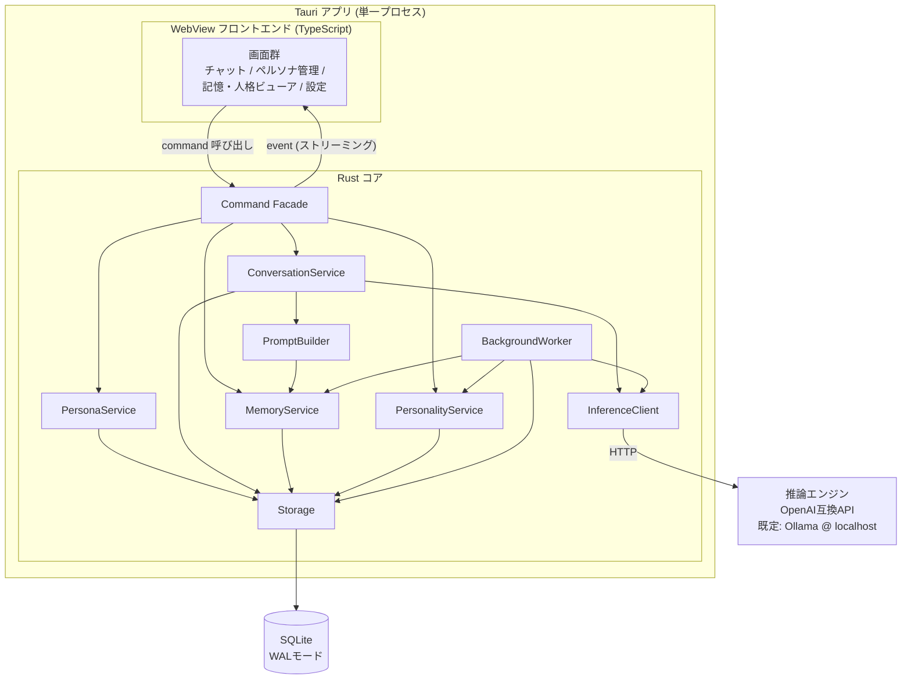
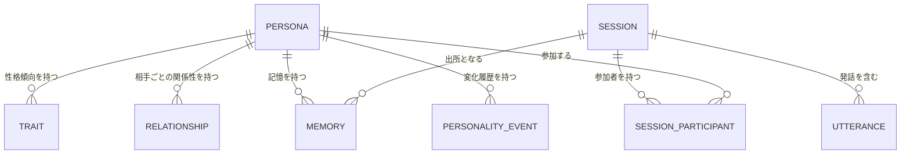
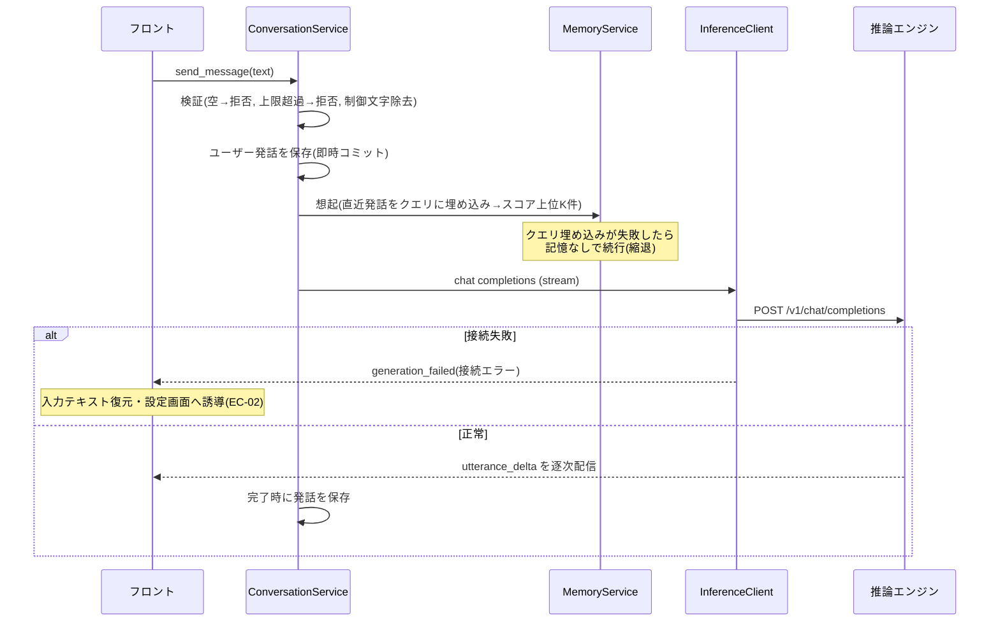

# Personacle 設計書

| 項目 | 内容 |
| --- | --- |
| バージョン | 1.4 |
| 作成日 | 2026-07-07 |
| 対応する要件書 | docs/requirements.md v0.1 |
| ステータス | 承認済み |

## 1. 概要

本書は、要件定義書 v0.1 の全要件(FR-01〜19、NFR-01〜07、EC-01〜12)を実現する基本設計・アーキテクチャ設計を記述する。要件書の未解決事項 9-1(UI形態)と 9-2(推論エンジン接続)は本書の ADR-01 / ADR-02 で決定した。

**承認状況**: 全ADR承認済み (ADR-01, 02, 04, 05 は設計時に発注者承認。ADR-03, 06, 07 は実装開始と初版のGUI確認をもって承認)。

## 2. 設計方針

1. **ローカル完結**: アプリが行う外部通信は、ユーザーが設定した推論エンジンのエンドポイント(既定 localhost)への HTTP のみとする(NFR-02, 03)
2. **応答経路の最優先**: ユーザーの発話から応答表示までの経路には、応答生成以外の推論(記憶抽出・人格評定・埋め込み計算)を挟まない。これらはセッション確定後の非同期処理に回す(NFR-01)
3. **追記優先**: 会話・記憶・人格変化はイベントとして追記し、現在値はそこから導出・キャッシュする。破壊的上書きを避け、履歴閲覧(FR-13)と障害時保全(NFR-05)を構造で担保する
4. **推論エンジン非依存**: 推論エンジンへの依存は OpenAI 互換 API の範囲(chat completions / embeddings)に限定する(ADR-02)
5. **ドメインロジックはコアに集約**: UI は表示・入力・ローカル状態のみを持ち、ペルソナ・記憶・人格に関する判断はすべて Rust コアで行う

## 3. 主要設計判断 (ADR)

### ADR-01: UI形態と技術スタック [ステータス: 承認済み]

- **コンテキスト**: 要件の未解決事項 9-1。将来の一般公開(配布容易性)と、SLM がメモリを大量消費する環境でのアプリ本体の軽さが求められる。関連: NFR-07、前提(Windows 11)
- **選択肢**:

  | 案 | 概要 | 利点 | 欠点 |
  | --- | --- | --- | --- |
  | A: Tauri 2 | Rust コア + WebView(TypeScript)のデスクトップアプリ | 配布サイズ・メモリ消費が小さい。チャットUIをWeb技術で構築できる。単一インストーラ配布 | Rust の学習コスト |
  | B: Electron | 全て TypeScript | 開発が速い | 配布サイズ100MB超、メモリ消費大。SLMと同居するアプリとして不利 |
  | C: C#/.NET | WinUI 3 / Avalonia | Windows親和性、単一exe配布 | チャットUI部品を自作する量が多い |
  | D: Python+ブラウザ | ローカルWebサーバー | プロトタイピング最速 | 一般公開時の配布が最も弱い |

- **決定**: 案A(Tauri 2 + TypeScript フロントエンド)。決め手はメモリフットプリントと配布容易性
- **却下理由**: B はSLM同居環境でのメモリ消費が方針に反する。C はチャットUIの構築コストが高い。D は「将来公開」の配布要件に対して最弱
- **影響**: 全体構成は Tauri のプロセスモデル(ADR-03)に従う。コア言語は Rust

### ADR-02: 推論エンジンとの接続方式 [ステータス: 承認済み]

- **コンテキスト**: 要件の未解決事項 9-2。FR-16(接続設定)、NFR-01(性能)、NFR-02(オフライン)。特定エンジンへのロックインを避けたい
- **選択肢**:

  | 案 | 概要 | 利点 | 欠点 |
  | --- | --- | --- | --- |
  | A: OpenAI互換API標準 | chat completions + embeddings を接続仕様とし、推奨・検証対象エンジンは Ollama | Ollama / llama.cpp server / LM Studio が同一仕様で動く。将来のクラウド対応(要件書の将来拡張)も同一IF | エンジン固有機能(モデル自動ロード)を使えない |
  | B: Ollamaネイティブ専用 | Ollama 独自APIに密結合 | モデル一覧取得・自動ロードでUX向上 | ロックイン。他エンジン利用者を切り捨てる |
  | C: 推論ライブラリ内蔵 | llama.cpp をアプリに組み込む | セットアップ最楽 | 要件の non-goals(エンジン同梱は初版対象外)に反する |

- **決定**: 案A。決め手は依存の軽さと変更容易性
- **却下理由**: B はロックインの不利益が UX 向上を上回る(モデル一覧取得のみ、OpenAI互換の `GET /v1/models` で代替可能)。C は要件変更が必要であり初版では見送り
- **影響**: InferenceClient(6章)の仕様は OpenAI 互換 API に固定。導入手順書(NFR-07)は Ollama を前提に書く

### ADR-03: 全体構成 [ステータス: 承認済み]

- **コンテキスト**: ADR-01 の帰結として構成を確定する。関連: 全FR
- **選択肢**:

  | 案 | 概要 | 利点 | 欠点 |
  | --- | --- | --- | --- |
  | A: Tauri単一プロセス | Rust コアにドメインロジック、WebView フロントは表示に徹する。通信は Tauri command / event | プロセス管理不要。IPC が型付きで単純 | コアとUIの言語が分かれる |
  | B: フロント + ローカルHTTPサーバー分離 | Rust を HTTP サーバーとして起動しフロントは fetch | Web版への転用が容易 | ポート管理・多重起動・サーバー生存監視が必要。シングルユーザー要件に過剰 |

- **決定(推奨)**: 案A。決め手は複雑さの低さ。シングルユーザー・ローカル完結(要件3章の前提)では分離の利点がない
- **却下理由**: B の利点(Web転用)は non-goals(クラウド化は別プロジェクト)に対応する投資であり、初版では過剰
- **影響**: コンポーネント間IFは Tauri command / event として設計する(6章)

### ADR-04: 記憶の想起方式 [ステータス: 承認済み]

- **コンテキスト**: FR-09(関連記憶の想起)、NFR-01(応答性能)、NFR-04(記憶1万件)、EC-06(上限到達)。日本語は表記ゆれが多く、キーワード一致だけでは「好物」と「好きな食べ物」を結べない
- **選択肢**:

  | 案 | 概要 | 利点 | 欠点 |
  | --- | --- | --- | --- |
  | A: ハイブリッド | 埋め込み類似度 + 新しさ + 重要度の加重スコアで上位K件を想起 | 意味的な関連を拾い、直近の約束や重要な出来事が古い雑談に埋もれない | 埋め込み計算が必要(バックグラウンドで実施) |
  | B: 全文検索のみ | SQLite FTS のキーワード検索 | 依存最小・高速 | 日本語の表記ゆれ・同義語に弱く FR-09 の品質が不安 |
  | C: 埋め込みのみ | ベクトル類似度単独 | 実装が単純 | 新しさ・重要度を無視し、直近の約束より古い類似記憶が出うる |

- **決定**: 案A。スコア式は `score = w_sim × 類似度 + w_rec × 新しさ減衰 + w_imp × 重要度`(重みは設定値、初期値は 8 章)。埋め込みは推論エンジンの embeddings API を使い追加依存なし
- **却下理由**: B は日本語品質、C は想起の時間感覚の欠如
- **影響**: 記憶エンティティは埋め込みベクトルと重要度を持つ(5章)。埋め込み計算はセッション後処理(ADR-06)に含める

### ADR-05: 人格プロファイルの表現 [ステータス: 承認済み]

- **コンテキスト**: FR-12(変化量上限のある成長)、FR-13(現在値と履歴の閲覧)、要件の未解決事項 9-4
- **選択肢**:

  | 案 | 概要 | 利点 | 欠点 |
  | --- | --- | --- | --- |
  | A: 数値軸+自由記述 | 性格傾向と関係性は数値軸で持ち変化量上限を数値で強制。相手ごとに短い自由記述(印象メモ)を併せ持つ | FR-12 の受け入れ基準(上限検証)をそのまま満たし、質的なニュアンスも表現できる | 2系統の更新処理が必要 |
  | B: 数値のみ | 性格軸と関係値だけ | 検証容易 | 「あの件以来気まずい」のような質的変化を表現できない |
  | C: 自由記述のみ | テキストをLLMが書き換え | 表現力最大 | 変化量上限を定義できず FR-12 を満たせない |

- **決定**: 案A。性格軸・関係性の数値定義と変化量上限の初期値は 5 章に示す(最終値は要件 9-4 のとおりプロトタイプで検証)
- **却下理由**: C は FR-12 の受け入れ基準を構造的に満たせない。B は成長の体験価値を損なう
- **影響**: 人格更新はLLMによる評定(デルタ提案)+コアによるクランプの2段構成(7章フロー3)

### ADR-06: 記憶生成・人格更新のタイミング [ステータス: 承認済み]

- **コンテキスト**: FR-08(記憶生成)、FR-12(人格更新)、NFR-01(応答性能)、EC-03(強制終了)。SLM は低速であり、対話中に抽出用の推論を挟むと応答性能を害する
- **選択肢**:

  | 案 | 概要 | 利点 | 欠点 |
  | --- | --- | --- | --- |
  | A: セッション確定後の非同期バッチ | セッション終了を契機にバックグラウンドで記憶抽出→埋め込み→人格評定を実行。未処理セッションは起動時に再処理 | 応答経路に追加推論ゼロ(NFR-01)。強制終了しても再処理で回復(EC-03) | セッション終了までは新規記憶が想起に載らない |
  | B: 発話ごと逐次抽出 | 各応答の後に毎回抽出 | 記憶の反映が最速 | 毎発話で推論が倍増し NFR-01 を圧迫。SLMの速度では非現実的 |

- **決定(推奨)**: 案A。同一セッション内の情報参照は会話履歴(プロンプト内)で担保されるため、記憶化がセッション終了後でも FR-05/09 の受け入れ基準を満たせる
- **却下理由**: B は NFR-01 と両立しない
- **影響**: セッションに処理状態(5章 `status`)を持たせ、起動時リカバリを実装する(7章フロー4)

### ADR-07: データ永続化方式 [ステータス: 承認済み]

- **コンテキスト**: FR-17(永続化)、NFR-04(容量)、NFR-05(強制終了時のデータ保全)
- **選択肢**:

  | 案 | 概要 | 利点 | 欠点 |
  | --- | --- | --- | --- |
  | A: SQLite 単一DB(WALモード) | 全データを1つのDBファイルに保存 | トランザクションで NFR-05(破損防止)を担保。1万件規模の検索・一覧(NFR-04)に十分。バックアップ=1ファイル | 記憶や人格を外部エディタで直接編集できない |
  | B: JSON/Markdownファイル群 | ペルソナごとのフォルダにテキスト保存 | 人が読める。Git管理できる | 書き込み中の強制終了で破損しうる(NFR-05)。件数増で一覧・検索が劣化(NFR-04) |

- **決定(推奨)**: 案A。決め手は NFR-05。埋め込みベクトルは BLOB カラムに格納し、1万件規模なら全走査の類似度計算で十分(8章の性能見積もり参照)。専用ベクトルDBは導入しない
- **却下理由**: B は強制終了時の保全を自前実装する必要があり複雑化する。人が読める形式の利点はアプリ内の閲覧画面(FR-10/13)とエクスポート(FR-18)で代替する
- **影響**: データ設計(5章)は SQLite の論理スキーマとして記述

### ADR-08: 3体以上の自律会話の発話順と後処理 [ステータス: 提案]

- **コンテキスト**: FR-19 (Could)。要件は発話順の制御方式を設計に委ねている。FR-12(1セッションあたりの変化量上限)との整合も必要
- **選択肢**:

  | 案 | 概要 | 利点 | 欠点 |
  | --- | --- | --- | --- |
  | A: ラウンドロビン | 参加者の登録順で巡回して発話 | 受け入れ基準「全員が1回以上発話」を決定的に満たす。実装・検証が単純 | 会話の流れ次第では不自然な順になりうる |
  | B: LLMによる次話者選択 | 毎ターン「次に話すべき者」をLLMに選ばせる | 会話として自然 | 推論が毎ターン1回増え低速。特定ペルソナが発話しない可能性があり受け入れ基準を保証できない |

- **決定(推奨)**: 案A。参加数上限は6体(コンテキスト予算と後処理コストの上限)。後処理の関係性評定は「自分以外の各参加者」ごとに実行し、**性格軸デルタの適用はセッションあたり1回のみ**とする(相手ごとに重ねて適用すると FR-12 の1セッション上限を実質超えるため)
- **却下理由**: B は受け入れ基準の保証と NFR-01 の観点で初版に不適。将来の差し替えポイントとしてターンループの発話者選択は分離してある
- **影響**: 7章フロー2 は参加者N体の巡回として一般化。プロンプトの「会話相手」節は複数相手の列挙に対応

### ADR-09: ペルソナのエクスポート形式 [ステータス: 提案]

- **コンテキスト**: FR-18 (Could)。「育てたキャラの共有」のため、ペルソナ1体分を別環境へ移せるファイル形式が必要。要件は会話履歴の同梱を選択制と定める
- **選択肢**:

  | 案 | 概要 | 利点 | 欠点 |
  | --- | --- | --- | --- |
  | A: JSON 1ファイル(埋め込み除外) | persona/trait/relationship/memory/personality_event (+選択で sessions) を JSON に書き出し、埋め込みは取込後に再計算 | 人が読める。埋め込みモデルが異なる環境でも成立。ファイルが小さい | 取込直後は想起が縮退(再計算完了まで) |
  | B: 埋め込み込みで完全複製 | ベクトルも書き出す | 取込直後から想起可能 | 移行先の埋め込みモデルが違うと無意味どころか有害。ファイル巨大 |
  | C: DBファイルごとコピー | personacle.db を渡す | 実装ゼロ | 1体単位にできず全ペルソナ・全会話が露出する。共有用途に不適 |

- **決定(推奨)**: 案A。ファイルに `format` / `formatVersion` / `appSchemaVersion`(設計5.3) を記録し、
  未対応バージョンは取込を拒否する。ID は取込時に全て新規発行し、出所セッション等の参照は張り替える。
  履歴を含めた場合のセッションは status=processed で取り込み、後処理の再実行(記憶の二重生成)を防ぐ。
  同名ペルソナが既存の場合は EC-04 と同様に警告+force。存在しない相手ペルソナへの関係参照は
  名前スナップショットで表示する(EC-07 と同じ扱い)
- **却下理由**: B は推論エンジン非依存の方針(設計方針4)と両立しない。C は共有の単位が要件と合わない
- **影響**: ファイル選択に公式 dialog プラグインを追加。取込後に埋め込み再計算ジョブを投入する

## 4. システム構成

| コンポーネント | 責務 |
| --- | --- |
| 画面群 (TS) | 表示・入力・画面内状態のみを持つ。ドメイン判断はしない |
| Command Facade | Tauri command / event の境界。入力検証(空入力、文字数上限、制御文字除去)をコアの入口として一元的に行う |
| PersonaService | ペルソナの作成・一覧・編集・削除。同名警告(EC-04)と削除時の関連データ整理(EC-07) |
| ConversationService | セッションのライフサイクル管理(開始・発話・終了)、1対1対話と自律会話のターン進行、生成キャンセル、ペルソナの排他制御(EC-08) |
| PromptBuilder | 人格プロファイル・想起記憶・会話履歴から、トークン予算内でプロンプトを組み立てる |
| MemoryService | 記憶の保存・想起(ハイブリッドスコアリング)・閲覧・編集・削除・上限時のアーカイブ(EC-06) |
| PersonalityService | 人格プロファイルの現在値管理、評定デルタのクランプと適用、変化イベントの追記 |
| BackgroundWorker | セッション確定後の後処理(記憶抽出→埋め込み→人格評定)を直列キューで実行。起動時に未処理セッションを回収 |
| InferenceClient | OpenAI互換APIクライアント。chat completions(ストリーミング)/ embeddings / models。接続エラーの分類(8章) |
| Storage | SQLite への読み書き。トランザクション境界の管理 |

## 5. データ設計

### 5.1 エンティティと関係

### 5.2 エンティティ定義(論理)

**persona** — AIキャラクター本体

| 属性 | 内容 |
| --- | --- |
| id | 一意ID |
| name | 名前(同名可・EC-04は警告のみ) |
| description / speech_style / values_text / self_intro | 初期設定4項目(FR-01)。編集可(FR-03) |
| created_at / last_talked_at | 作成日時・最終対話日時(FR-02) |

削除は**物理削除**(FR-04「復元できない」)。ただし他ペルソナ側に残るデータは 5.4 参照。

**trait** — 性格傾向(ペルソナ×軸)

| 属性 | 内容 |
| --- | --- |
| persona_id / trait_key | ペルソナと軸の複合キー |
| value | 0〜100 |

性格軸(2026-07-08 正式値として発注者承認・要件9-4解決): `社交性` `共感性` `慎重さ` `自己主張` `明朗さ` の5軸。作成時は初期設定文からLLMが初期値を評定し、ユーザーが調整できる。**1セッションあたり変化量上限: 各軸±2**(設定値)。

**relationship** — 相手ごとの関係性

| 属性 | 内容 |
| --- | --- |
| persona_id | 主体ペルソナ |
| target_kind / target_id | 相手(user または persona) |
| target_name | 相手名のスナップショット(相手ペルソナ削除後も表示可能にする・EC-07) |
| intimacy | 親密度 0〜100(初期値20)。**1セッションあたり変化量上限±5**(設定値) |
| impression_text | 短い自由記述の印象メモ(200文字以内)。セッション後処理でLLMが更新 |

**session** — 会話セッション

| 属性 | 内容 |
| --- | --- |
| id / kind | kind: user_dialogue / autonomous |
| theme | 自律会話のテーマ(FR-14)。1対1では空 |
| status | `active` → `ended` → `processed` の一方向遷移。後処理の進行管理と起動時リカバリ(EC-03)に使う |
| started_at / ended_at | 日時 |

**utterance** — 発話(追記のみ)

| 属性 | 内容 |
| --- | --- |
| id / session_id | 所属セッション |
| speaker_kind / speaker_id / speaker_name | 発話者(user / persona)。名前スナップショット |
| content | 本文 |
| state | `complete` / `canceled`(FR-07: キャンセル時は途中までの本文で保存) |
| created_at | 日時 |

**memory** — 記憶(FR-08)

| 属性 | 内容 |
| --- | --- |
| id / persona_id | 持ち主 |
| content | 本文(自然文1〜2文) |
| kind | fact(事実) / event(出来事) / promise(約束) / impression(感想) |
| importance | 1〜10。抽出時にLLMが評定 |
| embedding | 埋め込みベクトル(BLOB)。未計算は NULL(想起対象外のまま後処理で埋める) |
| source_session_id / created_at | 出所と発生日時(FR-08/10) |
| archived | 上限到達時のアーカイブフラグ(EC-06)。アーカイブ済みは想起対象外・閲覧は可能 |
| user_edited | ユーザー編集済みフラグ(FR-11)。編集時は embedding を再計算する |

**personality_event** — 人格変化の履歴(追記のみ、FR-12/13)

| 属性 | 内容 |
| --- | --- |
| id / persona_id / session_id | どのセッションで変化したか |
| item | 変化した項目(trait_key または relationship 対象) |
| old_value / new_value | 変化前後(数値または impression_text) |
| created_at | 日時 |

**app_setting** — 設定(FR-16)

エンドポイントURL、チャットモデル名、埋め込みモデル名、自律会話ターン数(既定12・上限50)、入力上限文字数(既定4,000)、想起件数K(既定8)、スコア重み、変化量上限。すべて key-value。

### 5.3 移行・互換

DB に `schema_version` を持ち、起動時にバージョンを検査してマイグレーションを順次適用する(要件の未解決事項 9-6 への回答)。初版は version=1。

### 5.4 削除の整合性(EC-07)

ペルソナ A を削除するとき:

- A の persona / trait / relationship / memory / personality_event / 参加記録は物理削除
- **他ペルソナ B が持つ** A に関する memory・relationship・personality_event は削除しない(B の経験として保持)。表示は target_name / speaker_name のスナップショットで行い、削除済み相手には「(削除済み)」を付す
- A が参加したセッションの utterance は speaker_name スナップショットにより閲覧可能なまま残す(FR-06)

## 6. インターフェース設計

### 6.1 フロントエンド ↔ コア (Tauri command)

主要 command(引数・戻り値は代表のみ。網羅は実装工程):

| command | 入出力 | エラー時 |
| --- | --- | --- |
| `list_personas` / `get_persona(id)` | ペルソナ一覧 / 詳細(trait, relationship 含む) | DataError |
| `create_persona(初期設定)` | 作成結果。同名存在時は `duplicate_name` 警告を返しフロントが確認後 `force=true` で再送(EC-04) | ValidationError |
| `update_persona(id, 初期設定)` / `delete_persona(id)` | 更新 / 削除(削除はフロントで確認ダイアログ後に呼ぶ) | BusyError(セッション参加中) |
| `start_session(kind, persona_ids, theme?)` | セッションID。参加ペルソナが他セッション参加中なら BusyError(EC-08) | BusyError |
| `send_message(session_id, text)` | 受理のみ即時返却。応答本文は event で配信 | ValidationError(空・上限超過) |
| `cancel_generation(session_id)` | 生成中断(FR-07)。中断済み発話を保存してから返る | — |
| `end_session(session_id)` | status=ended にし後処理キューへ投入 | — |
| `start_autonomous_turns(session_id)` / `stop_session(session_id)` | 自律会話の進行開始 / 停止フラグ設定(FR-14) | — |
| `list_sessions(persona_id)` / `get_session(session_id)` | 履歴閲覧(FR-06) | — |
| `list_memories(persona_id)` / `update_memory(id, content)` / `delete_memory(id)` | 記憶の閲覧・編集・削除(FR-10/11)。編集時は埋め込み再計算をキュー投入 | — |
| `get_personality(persona_id)` / `get_personality_history(persona_id)` | 現在値と変化履歴(FR-13) | — |
| `export_persona(persona_id, include_history, path)` / `import_persona(path, force)` | エクスポート/インポート(FR-18, ADR-09)。同名時は duplicate_name 警告を返しフロントが確認後 force 再送 | DataError / ValidationError |
| `get_settings` / `update_settings` / `test_connection` | 設定と接続確認(FR-16)。test_connection は chat と embeddings 両方の疎通を検査し個別の成否を返す | ConnectionError |

### 6.2 コア → フロントエンド (event)

| event | ペイロード | 用途 |
| --- | --- | --- |
| `utterance_started` | session_id, utterance_id, speaker | 発話枠の表示開始 |
| `utterance_delta` | utterance_id, 追記テキスト | ストリーミング表示(FR-05) |
| `utterance_completed` | utterance_id, state(complete/canceled) | 発話確定 |
| `generation_failed` | session_id, エラー分類, メッセージ | EC-02 の表示。フロントは入力テキストを復元する |
| `session_status_changed` | session_id, status | 自律会話の終了・後処理完了の反映 |
| `postprocess_completed` | session_id, 生成記憶件数, 人格変化件数 | 「◯件の記憶ができました」等の通知表示 |

### 6.3 コア ↔ 推論エンジン (OpenAI互換 HTTP)

- `POST /v1/chat/completions` (stream=true): 応答生成・自律会話の発話生成・記憶抽出・人格評定・初期trait評定。抽出・評定系は stream=false + JSON出力指示
- `POST /v1/embeddings`: 記憶本文と想起クエリの埋め込み
- `GET /v1/models`: 接続確認とモデル名の候補表示
- タイムアウト: 接続5秒 / 応答全体はNFR-01を踏まえ120秒。エラー分類は8章

### 6.4 プロンプト構成(PromptBuilder)

system プロンプトの構成順(トークン予算内で下から削る):

1. ペルソナの初期設定(FR-01の4項目)
2. 現在の性格傾向の言語化(数値→程度表現。例: 社交性72→「人と話すのが好き」)
3. 相手との関係性(親密度→距離感の指示、impression_text をそのまま)
4. 想起された記憶 上位K件(発生日時付き。ADR-04のスコア順)
5. 行動指示: 「記憶と会話履歴にないことは知らない・覚えていないと答える」(FR-09受け入れ基準)、口調維持、1発話の長さ制限

会話履歴は直近発話から遡ってトークン予算(モデルのコンテキスト長から system と生成余白を引いた残り)に収まる分を含める。

## 7. 主要フロー

### フロー1: 1対1対話の発話〜応答 (FR-05, 09 / EC-02, 09)

キャンセル(FR-07): `cancel_generation` はストリーム読み取りを中断し、受信済みテキストを state=canceled で保存してから `utterance_completed` を発行する。

### フロー2: 自律会話 (FR-14, 15 / EC-08, 12)

1. `start_session(autonomous, [A, B, …], theme)` — 参加者は2〜6体(FR-19, ADR-08)。いずれかが他の active セッションに参加中なら BusyError(EC-08)
2. ターンループ: 発話者は参加者の登録順で巡回する(ラウンドロビン。2体なら交互と一致。ADR-08)。各ターンで (a) 停止フラグ検査 → 立っていれば終了(FR-14: 次の生成前に停止) (b) 発話者視点でプロンプト構築(自分以外の全参加者を「会話相手」として関係性つきで提示、テーマを冒頭に) (c) ストリーミング生成・保存
3. 終了条件: ターン数が設定値に到達(EC-12) / 手動停止 / 連続生成失敗2回
4. 終了時に status=ended とし、**参加ペルソナそれぞれについて**後処理(フロー3)を実行 — 各参加者は同じ会話から各自の視点で別々の記憶を得て、自分以外の各参加者との関係性が更新される(FR-15/19)。性格軸デルタの適用はセッションあたり1回のみ(ADR-08)

### フロー3: セッション後処理 (FR-08, 12 / ADR-06)

BackgroundWorker が直列キューで実行。1ペルソナ分の処理:

1. **記憶抽出**: セッション全文(長い場合は分割)を LLM に渡し、記憶候補を JSON(content, kind, importance, 対象)で出力させる。JSON解析失敗は1回リトライし、それでも失敗したらそのセッションを `extract_failed` として記録・スキップ(ログに残す。会話履歴自体は残っているため後から再処理可能)
2. **埋め込み計算**: 各記憶の content を embeddings API でベクトル化して保存。失敗した記憶は embedding=NULL のまま残し次回起動時に再試行
3. **人格評定**: セッション全文と現在の人格プロファイルを LLM に渡し、各性格軸のデルタ(-5〜+5)・相手への親密度デルタ・新しい impression_text を JSON で提案させる
4. **クランプと適用**: PersonalityService がデルタを変化量上限(trait±2 / intimacy±5)に丸めて適用し、personality_event に追記(FR-12の上限保証はLLMではなくコアのコードで行う)
5. status=processed に更新、`postprocess_completed` を発行

**記憶上限(EC-06)**: 保存後に件数が上限(1万件)を超えていたら、超過分だけ「importance と新しさの複合スコア下位」から archived=true にする。直近30日の記憶はアーカイブ対象外(要件の「直近セッションの情報を優先保持」)。

### フロー4: 起動時リカバリ (EC-03 / NFR-05)

起動時に BackgroundWorker が:

1. status=active のセッション(強制終了の痕跡)→ ended に更新して後処理キューへ
2. status=ended のセッション → 後処理キューへ
3. embedding=NULL の記憶 → 埋め込み計算キューへ

保存済みデータは SQLite のトランザクション+WAL により強制終了でも破損しない。生成途中の応答は保存前なら消える(要件どおり許容)。

### フロー5: 初回起動 (EC-01)

起動時にペルソナ0件なら、フロントはオンボーディング画面(アプリ説明→接続設定と test_connection → 最初のペルソナ作成)を表示する。接続未設定のままでもペルソナ作成と閲覧はできる(推論が必要な操作の時点で EC-02 の誘導を出す)。

## 8. 横断的関心事

### エラー処理

| 分類 | 例 | ユーザーへの見せ方 | リトライ |
| --- | --- | --- | --- |
| ValidationError | 空入力、上限超過、名前なし | 入力欄近傍にメッセージ | なし(即時修正可能) |
| ConnectionError | エンジン未起動、接続先誤り | 「推論エンジンに接続できません」+確認事項+設定画面ボタン(EC-02) | 自動リトライなし。ユーザーの再操作 |
| GenerationError | 生成中のストリーム断 | 発話枠にエラー表示、入力復元 | 対話は手動、後処理は自動1回 |
| DataError | DB書き込み失敗 | ダイアログ+ログ参照案内 | なし。操作の再実行 |

バックグラウンド後処理の失敗はユーザー操作を妨げない(通知領域に表示し、次回起動時に自動再試行)。

### ログ (NFR-06)

Rust の構造化ログをローカルファイルに出力(日次ローテーション、保持14日)。レベル: エラー(通信・保存・解析失敗)、警告(縮退動作)、情報(セッション開始終了・後処理結果件数)。**会話本文・記憶本文は既定でログに含めない**。デバッグ設定を有効にした場合のみ含める。

### セキュリティ・プライバシー (NFR-03)

- アプリの外向き HTTP は InferenceClient の1箇所に集約し、接続先は設定されたエンドポイントのみ
- エンドポイントが localhost / 127.0.0.1 以外に設定された場合、「会話データがそのホストに送信される」旨の警告を表示して確認を取る
- 自動更新チェックやテレメトリは実装しない(初版)

### 性能 (NFR-01, 04)

- ストリーミング表示により体感応答は最初のトークン到着で始まる(NFR-01 の10秒以内は主にモデル・エンジン性能。設計側はプロンプトを短く保つ: system は最大でもコンテキストの1/3、想起はK=8件)
- 想起の類似度計算: 1万件 × 768次元の総当たりコサイン類似度は数十ミリ秒(Rust, SIMD不使用でも)であり専用インデックス不要。NFR-04 の規模で NFR-01 に影響しない
- 一覧表示(NFR-04 の3秒以内): 主要な外部キーと created_at にインデックスを張り、発話・記憶の一覧はページング(100件単位)で返す

### 導入 (NFR-07)

README に「Ollama のインストール → 推奨モデルの pull → 本アプリのインストール → オンボーディングで接続確認」の手順を記載。推奨モデル名は PoC(10章)後に確定して記載する。

## 9. トレーサビリティ表

| 要件 ID | 対応する節/設計要素 | 備考 |
| --- | --- | --- |
| FR-01 | 4章 PersonaService、5.2 persona/trait、6.1 create_persona | 初期trait評定は6.3 |
| FR-02 | 6.1 list_personas / get_persona、5.2 last_talked_at | |
| FR-03 | 6.1 update_persona | 記憶・成長分は別エンティティのため構造的に不変 |
| FR-04 | 5.2 persona(物理削除)、5.4、6.1 delete_persona | |
| FR-05 | 7章フロー1、6.2 utterance_delta、6.4 | |
| FR-06 | 5.2 session/utterance(追記)、6.1 list_sessions | |
| FR-07 | 6.1 cancel_generation、5.2 utterance.state | |
| FR-08 | 7章フロー3(記憶抽出)、5.2 memory | |
| FR-09 | ADR-04、6.4(想起+「知らないと答える」指示) | |
| FR-10 | 6.1 list_memories、5.2 memory(出所・日時) | |
| FR-11 | 6.1 update_memory / delete_memory、5.2 user_edited | |
| FR-12 | ADR-05、7章フロー3(クランプはコアで実施)、5.2 trait/relationship | |
| FR-13 | 5.2 personality_event(追記)、6.1 get_personality_history | |
| FR-14 | 7章フロー2、5.2 session(theme)、app_setting(ターン上限) | |
| FR-15 | 7章フロー2 手順4(参加者ごとの後処理) | |
| FR-16 | 6.1 test_connection、6.3、5.2 app_setting | |
| FR-17 | ADR-07(SQLite+WAL)、5章全体 | |
| FR-18 | ADR-09(JSON 1ファイル・埋め込み除外)、6.1 export_persona / import_persona | 取込後に埋め込みを再計算 |
| FR-19 | ADR-08(ラウンドロビン・上限6体)、7章フロー2 | LLMによる次話者選択への差し替えポイントあり |
| NFR-01 | 設計方針2、ADR-06、8章 性能 | 実測は10章 R-1 |
| NFR-02 | 設計方針1、ADR-02(ローカルエンジン) | |
| NFR-03 | 8章 セキュリティ・プライバシー | |
| NFR-04 | ADR-07、8章 性能(総当たり見積もり・ページング) | |
| NFR-05 | ADR-07(WAL+トランザクション)、7章フロー4 | |
| NFR-06 | 8章 ログ | |
| NFR-07 | 8章 導入、ADR-02(Ollama前提の手順書) | 推奨モデルは10章 R-2 の後に確定 |
| EC-01 | 7章フロー5 | |
| EC-02 | 7章フロー1 alt、8章 エラー処理、6.2 generation_failed | |
| EC-03 | 7章フロー4 | |
| EC-04 | 6.1 create_persona(duplicate_name 警告+force) | |
| EC-05 | 6.1 send_message 検証、app_setting(上限4,000文字) | フロントは文字数カウンタ表示 |
| EC-06 | 7章フロー3 記憶上限(アーカイブ方式) | |
| EC-07 | 5.4 削除の整合性(名前スナップショット) | |
| EC-08 | 6.1 start_session の BusyError、ConversationService の排他 | |
| EC-09 | 7章フロー1 検証 | |
| EC-10 | Command Facade(制御文字除去)、UTF-8保存 | |
| EC-11 | FR-11/13 の閲覧・是正手段で担保(要件どおり自動検出なし) | |
| EC-12 | 7章フロー2 終了条件(ターン上限+手動停止+連続失敗) | |

## 10. リスクと検証方法

| # | リスク | 内容 | 検証方法 |
| --- | --- | --- | --- |
| R-1 | 応答性能の見込み違い | 推奨環境(GPUなし16GB)で NFR-01(初トークン10秒)を満たせない可能性 | 実装初期に候補モデル×量子化で実測。満たせない場合は推奨環境の見直しを発注者に提案(要件9-3) |
| R-2 | SLMの日本語品質・人格維持力 | 小型モデルでは口調維持や「知らないことを知らないと言う」が不安定な可能性 | PoC: 候補モデル(4B〜9B級)でFR-01/09の受け入れ基準を試行し、推奨モデルを確定 |
| R-3 | 記憶抽出のJSON出力信頼性 | SLMが正しいJSONを返さない可能性 | PoC で成功率を計測。フロー3のリトライ+失敗記録で運用上は破綻しない設計だが、成功率が低ければ抽出プロンプトを行区切りテキスト形式に変更 |
| R-4 | 人格評定の妥当性 | LLM評定のデルタが体感として不自然(変わらなすぎ/変わりすぎ)な可能性 | プロトタイプで10セッション連続対話を行い、変化量上限と重みを調整(要件9-4) |
| R-5 | コンテキスト長不足 | 小型モデルのコンテキストに system+履歴が収まらない可能性 | 6.4 のトークン予算で構造的に対処済み。PoC で品質劣化がないか確認 |

## 11. 未解決事項

| # | 論点 | 決定に必要な情報 | 決定者 |
| --- | --- | --- | --- |
| D-1 | ~~推奨モデルの確定(要件9-2の残り)~~ **解決済み (2026-07-08)**: 推奨は gemma4 (8B)。gpt-oss:20b は高メモリ環境の代替。PoC計測の記録は plan.md「D-1」節。GPUなし16GB環境での実測(要件9-3)は未検証のまま残る | — | 発注者 |
| D-2 | 性格軸5軸と変化量上限の最終確定(要件9-4) | R-4 のプロトタイプ結果 | 発注者 |
| D-3 | 画面デザインの詳細(レイアウト、配色) | 実装時にプロトタイプで確認 | 発注者 |
| D-4 | ~~配布形態・ライセンス(要件9-5)~~ **解決済み (2026-07-08)**: MIT + GitHub Releases。調査と決定記録は docs/licensing.md | — | 発注者 |

## 12. 変更履歴

| 日付 | 版 | 変更内容 |
| --- | --- | --- |
| 2026-07-07 | 0.1 | 初版作成 |
| 2026-07-08 | 1.0 | 実装完了・GUI確認をもって全ADRを承認済みに変更 |
| 2026-07-08 | 1.1 | FR-19 実装に伴い ADR-08 (発話順ラウンドロビン・上限6体・性格デルタ1回適用) を追加 |
| 2026-07-08 | 1.2 | FR-18 実装に伴い ADR-09 (エクスポート形式・埋め込み除外・processed取込) を追加 |
| 2026-07-08 | 1.3 | D-4 解決 (MIT + GitHub Releases)。docs/licensing.md に決定記録 |
| 2026-07-08 | 1.4 | D-1 解決 (推奨モデル gemma4)。PoC計測ハーネス poc_test.rs を追加 |
